Berikut **ERD final versi 1.0 proyek EMI — E-Learning Mekongga Indonesia**, disusun berdasarkan alur dan aturan yang sudah disepakati.

ERD ini menggunakan:

```text
Database utama : PostgreSQL
Primary key     : UUID
Backend         : Laravel REST API
Frontend web    : Next.js
Mobile          : Flutter + SQLite lokal
Storage         : Object Storage
```

# 1. Aturan sistem yang menjadi dasar ERD

ERD ini mempertahankan aturan berikut:

1. Role hanya terdiri dari **Admin, Guru, dan Siswa**.
2. Admin dapat mengakses seluruh sekolah, kelas, pengguna, kamus, modul, kuis, progress, dan basis pengetahuan AI.
3. Sekolah dan kelas hanya dibuat oleh Admin.
4. Guru dan siswa mendaftar dengan memilih sekolah dan kelas.
5. Akun guru dan siswa harus disetujui Admin.
6. Satu akun guru hanya terhubung ke satu kelas aktif.
7. Satu kelas hanya memiliki satu guru aktif.
8. Satu siswa hanya terhubung ke satu kelas aktif.
9. Siswa dan guru tidak dapat berpindah kelas sendiri.
10. Admin membuat modul dan kuis default.
11. Modul dan kuis default disalin ke kelas agar guru dapat mengedit versi kelasnya tanpa mengubah data pusat.
12. Kamus dapat diimpor melalui CSV dan ZIP audio.
13. Nama audio dalam CSV harus cocok dengan nama MP3 dalam ZIP.
14. Kamus dan basis pengetahuan chatbot berada di PostgreSQL yang sama, tetapi menggunakan tabel berbeda.
15. Speaking menggunakan kata target, audio native speaker, rekaman siswa, transkrip, skor, dan feedback.
16. PostgreSQL menjadi sumber data utama, sedangkan SQLite Flutter hanya menjadi cache dan penyimpanan pending sync.

---

# 2. ERD utama dalam format Mermaid

Kode berikut dapat ditempel di Mermaid Live Editor, Notion, GitHub, atau dokumentasi Markdown yang mendukung Mermaid.

```mermaid
erDiagram

    USERS {
        uuid id PK
        varchar full_name
        varchar email UK
        varchar password_hash
        varchar role
        varchar status
        uuid approved_by FK
        timestamp approved_at
        text rejected_reason
        timestamp last_login_at
        timestamp created_at
        timestamp updated_at
    }

    SCHOOLS {
        uuid id PK
        varchar name
        text address
        varchar phone
        varchar status
        uuid created_by FK
        timestamp created_at
        timestamp updated_at
    }

    CLASSES {
        uuid id PK
        uuid school_id FK
        varchar name
        varchar grade_level
        varchar academic_year
        varchar status
        uuid created_by FK
        timestamp created_at
        timestamp updated_at
    }

    REGISTRATION_REQUESTS {
        uuid id PK
        uuid user_id FK
        uuid school_id FK
        uuid class_id FK
        varchar requested_role
        varchar status
        uuid reviewed_by FK
        text review_note
        timestamp reviewed_at
        timestamp created_at
        timestamp updated_at
    }

    TEACHER_CLASS_ASSIGNMENTS {
        uuid id PK
        uuid teacher_id FK
        uuid class_id FK
        uuid assigned_by FK
        boolean is_active
        timestamp assigned_at
        timestamp ended_at
        timestamp created_at
        timestamp updated_at
    }

    STUDENT_CLASS_MEMBERSHIPS {
        uuid id PK
        uuid student_id FK
        uuid class_id FK
        uuid assigned_by FK
        boolean is_active
        timestamp joined_at
        timestamp ended_at
        timestamp created_at
        timestamp updated_at
    }

    MEDIA_FILES {
        uuid id PK
        uuid uploaded_by FK
        varchar original_name
        varchar stored_name
        varchar storage_path
        varchar public_url
        varchar mime_type
        varchar media_type
        bigint file_size
        varchar checksum
        jsonb metadata
        varchar status
        timestamp created_at
        timestamp updated_at
    }

    DICTIONARY_CATEGORIES {
        uuid id PK
        varchar name
        text description
        timestamp created_at
        timestamp updated_at
    }

    DICTIONARY_ENTRIES {
        uuid id PK
        uuid category_id FK
        varchar indonesia_word
        varchar english_word
        varchar mekongga_word
        text example_mekongga
        text example_indonesia
        text pronunciation_note
        uuid audio_media_id FK
        varchar status
        uuid created_by FK
        uuid updated_by FK
        uuid source_import_job_id FK
        timestamp created_at
        timestamp updated_at
    }

    DICTIONARY_IMPORT_JOBS {
        uuid id PK
        uuid uploaded_by FK
        uuid csv_media_id FK
        uuid zip_media_id FK
        integer total_rows
        integer success_rows
        integer failed_rows
        integer matched_audio
        integer unmatched_audio
        varchar status
        timestamp started_at
        timestamp finished_at
        timestamp created_at
        timestamp updated_at
    }

    DICTIONARY_IMPORT_ERRORS {
        uuid id PK
        uuid import_job_id FK
        integer row_number
        varchar error_code
        text error_message
        jsonb raw_data
        timestamp created_at
    }

    MODULE_TEMPLATES {
        uuid id PK
        varchar title
        text description
        varchar category
        uuid thumbnail_media_id FK
        integer order_number
        varchar status
        integer version
        uuid created_by FK
        timestamp published_at
        timestamp created_at
        timestamp updated_at
    }

    LESSON_TEMPLATES {
        uuid id PK
        uuid module_template_id FK
        varchar title
        varchar content_type
        text content_body
        uuid media_id FK
        varchar external_url
        integer order_number
        varchar status
        timestamp created_at
        timestamp updated_at
    }

    CLASS_MODULES {
        uuid id PK
        uuid class_id FK
        uuid source_module_template_id FK
        varchar title
        text description
        varchar category
        uuid thumbnail_media_id FK
        integer order_number
        boolean is_customized
        varchar status
        uuid created_by FK
        uuid updated_by FK
        timestamp published_at
        timestamp created_at
        timestamp updated_at
    }

    CLASS_LESSONS {
        uuid id PK
        uuid class_module_id FK
        uuid source_lesson_template_id FK
        varchar title
        varchar content_type
        text content_body
        uuid media_id FK
        varchar external_url
        integer order_number
        varchar status
        timestamp created_at
        timestamp updated_at
    }

    LESSON_PROGRESS {
        uuid id PK
        uuid student_id FK
        uuid class_lesson_id FK
        varchar status
        timestamp started_at
        timestamp completed_at
        timestamp last_opened_at
        timestamp created_at
        timestamp updated_at
    }

    MODULE_PROGRESS {
        uuid id PK
        uuid student_id FK
        uuid class_module_id FK
        integer total_lessons
        integer completed_lessons
        decimal progress_percent
        varchar status
        timestamp last_activity_at
        timestamp created_at
        timestamp updated_at
    }

    QUIZ_TEMPLATES {
        uuid id PK
        varchar title
        text description
        text instructions
        integer duration_minutes
        integer max_attempts
        varchar status
        uuid created_by FK
        timestamp published_at
        timestamp created_at
        timestamp updated_at
    }

    QUIZ_TEMPLATE_QUESTIONS {
        uuid id PK
        uuid quiz_template_id FK
        varchar question_type
        text question_text
        uuid image_media_id FK
        text correct_answer_text
        boolean use_fuzzy_matching
        decimal fuzzy_threshold
        decimal points
        integer order_number
        timestamp created_at
        timestamp updated_at
    }

    QUIZ_TEMPLATE_OPTIONS {
        uuid id PK
        uuid question_id FK
        text option_text
        boolean is_correct
        integer order_number
        timestamp created_at
        timestamp updated_at
    }

    CLASS_QUIZZES {
        uuid id PK
        uuid class_id FK
        uuid source_quiz_template_id FK
        varchar title
        text description
        text instructions
        integer duration_minutes
        integer max_attempts
        boolean show_result
        varchar status
        uuid created_by FK
        uuid updated_by FK
        timestamp open_at
        timestamp close_at
        timestamp published_at
        timestamp created_at
        timestamp updated_at
    }

    QUIZ_QUESTIONS {
        uuid id PK
        uuid class_quiz_id FK
        uuid source_template_question_id FK
        varchar question_type
        text question_text
        uuid image_media_id FK
        text correct_answer_text
        boolean use_fuzzy_matching
        decimal fuzzy_threshold
        decimal points
        integer order_number
        timestamp created_at
        timestamp updated_at
    }

    QUIZ_OPTIONS {
        uuid id PK
        uuid question_id FK
        text option_text
        boolean is_correct
        integer order_number
        timestamp created_at
        timestamp updated_at
    }

    QUIZ_ATTEMPTS {
        uuid id PK
        uuid class_quiz_id FK
        uuid student_id FK
        integer attempt_number
        decimal score
        decimal max_score
        varchar status
        timestamp started_at
        timestamp submitted_at
        timestamp graded_at
        timestamp created_at
        timestamp updated_at
    }

    QUIZ_ANSWERS {
        uuid id PK
        uuid quiz_attempt_id FK
        uuid question_id FK
        uuid selected_option_id FK
        text answer_text
        boolean is_correct
        decimal similarity_score
        decimal score_awarded
        text feedback
        timestamp created_at
        timestamp updated_at
    }

    SPEAKING_ITEMS {
        uuid id PK
        uuid dictionary_entry_id FK
        uuid class_lesson_id FK
        varchar target_text
        uuid native_audio_media_id FK
        varchar phonetic_breakdown
        varchar difficulty_level
        varchar status
        uuid created_by FK
        timestamp created_at
        timestamp updated_at
    }

    SPEAKING_ATTEMPTS {
        uuid id PK
        uuid student_id FK
        uuid speaking_item_id FK
        uuid recording_media_id FK
        text transcript_text
        varchar target_text
        decimal text_similarity_score
        decimal audio_similarity_score
        decimal final_score
        text feedback_text
        jsonb feedback_detail
        varchar engine_version
        varchar status
        timestamp created_at
        timestamp updated_at
    }

    CHATBOT_CATEGORIES {
        uuid id PK
        varchar name
        text description
        timestamp created_at
        timestamp updated_at
    }

    CHATBOT_KNOWLEDGE_DOCUMENTS {
        uuid id PK
        uuid category_id FK
        varchar title
        text content
        varchar source_name
        text source_description
        varchar status
        uuid verified_by FK
        timestamp verified_at
        uuid created_by FK
        uuid updated_by FK
        timestamp created_at
        timestamp updated_at
    }

    CHATBOT_KNOWLEDGE_CHUNKS {
        uuid id PK
        uuid document_id FK
        text chunk_text
        integer chunk_order
        vector embedding
        jsonb metadata
        timestamp created_at
        timestamp updated_at
    }

    CHATBOT_DICTIONARY_LINKS {
        uuid id PK
        uuid knowledge_document_id FK
        uuid dictionary_entry_id FK
        varchar relation_type
        timestamp created_at
    }

    CHATBOT_CONVERSATIONS {
        uuid id PK
        uuid user_id FK
        varchar title
        timestamp created_at
        timestamp updated_at
    }

    CHATBOT_MESSAGES {
        uuid id PK
        uuid conversation_id FK
        varchar sender
        text message_text
        jsonb model_metadata
        timestamp created_at
    }

    CHATBOT_MESSAGE_SOURCES {
        uuid id PK
        uuid message_id FK
        uuid dictionary_entry_id FK
        uuid knowledge_document_id FK
        decimal relevance_score
        timestamp created_at
    }

    CULTURAL_CONTENTS {
        uuid id PK
        varchar title
        varchar category
        text summary
        text content_body
        uuid thumbnail_media_id FK
        uuid main_media_id FK
        varchar external_url
        varchar source_name
        varchar status
        uuid created_by FK
        uuid updated_by FK
        timestamp published_at
        timestamp created_at
        timestamp updated_at
    }

    MOBILE_DEVICES {
        uuid id PK
        uuid user_id FK
        varchar device_uuid UK
        varchar device_name
        varchar platform
        varchar app_version
        timestamp last_sync_at
        timestamp created_at
        timestamp updated_at
    }

    SYNC_OPERATIONS {
        uuid id PK
        uuid device_id FK
        uuid user_id FK
        varchar client_operation_id UK
        varchar entity_type
        uuid entity_id
        varchar operation_type
        jsonb payload
        varchar status
        text error_message
        timestamp synced_at
        timestamp created_at
        timestamp updated_at
    }

    NOTIFICATIONS {
        uuid id PK
        uuid user_id FK
        varchar type
        varchar title
        text message
        jsonb data
        boolean is_read
        timestamp read_at
        timestamp created_at
    }

    SYSTEM_SETTINGS {
        uuid id PK
        varchar setting_key UK
        jsonb setting_value
        text description
        uuid updated_by FK
        timestamp created_at
        timestamp updated_at
    }

    AUDIT_LOGS {
        uuid id PK
        uuid user_id FK
        varchar action
        varchar entity_type
        uuid entity_id
        jsonb old_values
        jsonb new_values
        varchar ip_address
        text user_agent
        timestamp created_at
    }

    IOT_DEVICES {
        uuid id PK
        varchar device_code UK
        varchar name
        uuid school_id FK
        uuid class_id FK
        varchar status
        uuid registered_by FK
        timestamp last_seen_at
        timestamp created_at
        timestamp updated_at
    }

    IOT_ACTIVITY_LOGS {
        uuid id PK
        uuid device_id FK
        uuid user_id FK
        varchar activity_type
        jsonb payload
        timestamp created_at
    }


    USERS ||--o{ REGISTRATION_REQUESTS : submits
    USERS ||--o{ SCHOOLS : creates
    USERS ||--o{ CLASSES : creates
    USERS ||--o{ TEACHER_CLASS_ASSIGNMENTS : teacher
    USERS ||--o{ STUDENT_CLASS_MEMBERSHIPS : student
    USERS ||--o{ MEDIA_FILES : uploads

    SCHOOLS ||--o{ CLASSES : has
    SCHOOLS ||--o{ REGISTRATION_REQUESTS : selected
    CLASSES ||--o{ REGISTRATION_REQUESTS : requested
    CLASSES ||--o{ TEACHER_CLASS_ASSIGNMENTS : assigns
    CLASSES ||--o{ STUDENT_CLASS_MEMBERSHIPS : contains

    DICTIONARY_CATEGORIES ||--o{ DICTIONARY_ENTRIES : categorizes
    MEDIA_FILES ||--o{ DICTIONARY_ENTRIES : reference_audio
    DICTIONARY_IMPORT_JOBS ||--o{ DICTIONARY_ENTRIES : imports
    DICTIONARY_IMPORT_JOBS ||--o{ DICTIONARY_IMPORT_ERRORS : records

    MODULE_TEMPLATES ||--o{ LESSON_TEMPLATES : contains
    CLASSES ||--o{ CLASS_MODULES : receives
    MODULE_TEMPLATES ||--o{ CLASS_MODULES : copied_to
    CLASS_MODULES ||--o{ CLASS_LESSONS : contains
    LESSON_TEMPLATES ||--o{ CLASS_LESSONS : copied_to

    USERS ||--o{ LESSON_PROGRESS : student_progress
    CLASS_LESSONS ||--o{ LESSON_PROGRESS : tracked
    USERS ||--o{ MODULE_PROGRESS : student_progress
    CLASS_MODULES ||--o{ MODULE_PROGRESS : tracked

    QUIZ_TEMPLATES ||--o{ QUIZ_TEMPLATE_QUESTIONS : contains
    QUIZ_TEMPLATE_QUESTIONS ||--o{ QUIZ_TEMPLATE_OPTIONS : has
    CLASSES ||--o{ CLASS_QUIZZES : receives
    QUIZ_TEMPLATES ||--o{ CLASS_QUIZZES : copied_to
    CLASS_QUIZZES ||--o{ QUIZ_QUESTIONS : contains
    QUIZ_TEMPLATE_QUESTIONS ||--o{ QUIZ_QUESTIONS : copied_to
    QUIZ_QUESTIONS ||--o{ QUIZ_OPTIONS : has
    CLASS_QUIZZES ||--o{ QUIZ_ATTEMPTS : attempted
    USERS ||--o{ QUIZ_ATTEMPTS : student_attempts
    QUIZ_ATTEMPTS ||--o{ QUIZ_ANSWERS : contains
    QUIZ_QUESTIONS ||--o{ QUIZ_ANSWERS : answered
    QUIZ_OPTIONS ||--o{ QUIZ_ANSWERS : selected

    DICTIONARY_ENTRIES ||--o{ SPEAKING_ITEMS : source
    CLASS_LESSONS ||--o{ SPEAKING_ITEMS : includes
    SPEAKING_ITEMS ||--o{ SPEAKING_ATTEMPTS : attempted
    USERS ||--o{ SPEAKING_ATTEMPTS : student
    MEDIA_FILES ||--o{ SPEAKING_ATTEMPTS : recording

    CHATBOT_CATEGORIES ||--o{ CHATBOT_KNOWLEDGE_DOCUMENTS : categorizes
    CHATBOT_KNOWLEDGE_DOCUMENTS ||--o{ CHATBOT_KNOWLEDGE_CHUNKS : split_into
    CHATBOT_KNOWLEDGE_DOCUMENTS ||--o{ CHATBOT_DICTIONARY_LINKS : connects
    DICTIONARY_ENTRIES ||--o{ CHATBOT_DICTIONARY_LINKS : connects

    USERS ||--o{ CHATBOT_CONVERSATIONS : owns
    CHATBOT_CONVERSATIONS ||--o{ CHATBOT_MESSAGES : contains
    CHATBOT_MESSAGES ||--o{ CHATBOT_MESSAGE_SOURCES : cites
    DICTIONARY_ENTRIES ||--o{ CHATBOT_MESSAGE_SOURCES : source
    CHATBOT_KNOWLEDGE_DOCUMENTS ||--o{ CHATBOT_MESSAGE_SOURCES : source

    USERS ||--o{ MOBILE_DEVICES : owns
    MOBILE_DEVICES ||--o{ SYNC_OPERATIONS : sends
    USERS ||--o{ SYNC_OPERATIONS : performs
    USERS ||--o{ NOTIFICATIONS : receives
    USERS ||--o{ AUDIT_LOGS : performs

    SCHOOLS ||--o{ IOT_DEVICES : owns
    CLASSES ||--o{ IOT_DEVICES : assigned
    IOT_DEVICES ||--o{ IOT_ACTIVITY_LOGS : records
```



---

# 3. Pembagian tabel berdasarkan fitur

## A. Autentikasi, pengguna, sekolah, dan kelas

| Tabel                       | Fungsi                               |
| --------------------------- | ------------------------------------ |
| `users`                     | Semua akun Admin, Guru, dan Siswa    |
| `schools`                   | Asal sekolah yang dibuat Admin       |
| `classes`                   | Kelas berdasarkan sekolah            |
| `registration_requests`     | Permintaan registrasi guru/siswa     |
| `teacher_class_assignments` | Hubungan akun guru dengan satu kelas |
| `student_class_memberships` | Hubungan siswa dengan satu kelas     |

Alur:

```text
Admin membuat sekolah
→ Admin membuat kelas
→ Guru/Siswa mendaftar
→ Data masuk registration_requests
→ Admin menyetujui
→ Guru masuk teacher_class_assignments
→ Siswa masuk student_class_memberships
```

---

## B. Media dan file

| Tabel         | Fungsi                                                |
| ------------- | ----------------------------------------------------- |
| `media_files` | Menyimpan metadata file yang berada di object storage |

File yang dicatat:

* audio kamus
* audio native speaker
* rekaman siswa
* PDF
* gambar soal
* foto budaya
* video
* CSV
* ZIP audio

File tidak disimpan langsung dalam PostgreSQL. PostgreSQL hanya menyimpan URL, path, nama, ukuran, dan metadata.

---

## C. Kamus tiga bahasa

| Tabel                      | Fungsi                                              |
| -------------------------- | --------------------------------------------------- |
| `dictionary_categories`    | Verba, nomina, adjektiva, sapaan, dan kategori lain |
| `dictionary_entries`       | Indonesia–Inggris–Mekongga, contoh kalimat, audio   |
| `dictionary_import_jobs`   | Riwayat import CSV dan ZIP audio                    |
| `dictionary_import_errors` | Kesalahan per baris CSV                             |

Format CSV:

```csv
indonesia,english,mekongga,kategori,contoh_mekongga,contoh_indonesia,audio_filename
makan,eat,monga,verba,inoi monga kade,saya sedang makan nasi,monga.mp3
```

Alur pencocokan:

```text
audio_filename di CSV
       ↓
dicocokkan dengan nama MP3 dalam ZIP
       ↓
file yang cocok masuk media_files
       ↓
relasi disimpan di dictionary_entries.audio_media_id
```

---

## D. Modul default dan modul kelas

| Tabel              | Fungsi                          |
| ------------------ | ------------------------------- |
| `module_templates` | Modul default yang dibuat Admin |
| `lesson_templates` | Materi dalam modul default      |
| `class_modules`    | Salinan modul untuk kelas       |
| `class_lessons`    | Salinan materi untuk kelas      |
| `lesson_progress`  | Status tiap materi siswa        |
| `module_progress`  | Ringkasan progress modul siswa  |

Alur:

```text
Admin membuat module_templates
→ Admin membuat lesson_templates
→ Modul diterapkan ke kelas
→ Sistem menyalin ke class_modules
→ Materi disalin ke class_lessons
→ Guru mengedit versi kelas
→ Template Admin tidak berubah
```

Guru juga dapat membuat modul kelas baru. Untuk modul buatan guru:

```text
class_modules.source_module_template_id = null
```

Status progress:

```text
not_started
in_progress
completed
```

---

## E. Kuis default dan kuis kelas

| Tabel                     | Fungsi                      |
| ------------------------- | --------------------------- |
| `quiz_templates`          | Kuis default Admin          |
| `quiz_template_questions` | Soal kuis default           |
| `quiz_template_options`   | Pilihan jawaban default     |
| `class_quizzes`           | Kuis yang berlaku di kelas  |
| `quiz_questions`          | Soal versi kelas            |
| `quiz_options`            | Pilihan jawaban versi kelas |
| `quiz_attempts`           | Riwayat pengerjaan siswa    |
| `quiz_answers`            | Jawaban per soal            |

Jenis soal:

```text
multiple_choice
short_answer
```

Untuk soal bergambar:

```text
quiz_questions.image_media_id
→ media_files.id
```

Untuk isian singkat:

```text
correct_answer_text
use_fuzzy_matching
fuzzy_threshold
```

Contohnya, jawaban `mokongga` dapat dibandingkan dengan `mekongga` menggunakan skor kemiripan.

---

## F. Latihan speaking

| Tabel               | Fungsi                                       |
| ------------------- | -------------------------------------------- |
| `speaking_items`    | Kata atau kalimat target                     |
| `speaking_attempts` | Rekaman, transkrip, skor, dan feedback siswa |

Alur:

```text
Siswa memilih kata
→ Sistem mengambil audio native
→ Siswa merekam suara
→ Rekaman masuk object storage
→ Laravel mengirim audio ke FastAPI
→ FastAPI menghasilkan transkrip dan skor
→ Hasil disimpan ke speaking_attempts
```

Contoh data hasil:

```text
target_text            : mekongga
transcript_text        : mokongga
text_similarity_score  : 84
audio_similarity_score : 80
final_score            : 82
feedback_text          : Perhatikan vokal kedua
```

---

## G. Basis pengetahuan AI

| Tabel                         | Fungsi                                     |
| ----------------------------- | ------------------------------------------ |
| `chatbot_categories`          | Bahasa, budaya, sejarah, dan kategori lain |
| `chatbot_knowledge_documents` | Dokumen sumber dari Pak Karuddin/client    |
| `chatbot_knowledge_chunks`    | Potongan dokumen untuk pencarian AI        |
| `chatbot_dictionary_links`    | Relasi dokumen dengan kata kamus           |
| `chatbot_conversations`       | Percakapan pengguna                        |
| `chatbot_messages`            | Pesan user dan AI                          |
| `chatbot_message_sources`     | Sumber yang dipakai untuk jawaban          |

Alur pertanyaan:

```text
User bertanya
→ Sistem mencari dictionary_entries
→ Sistem mencari chatbot_knowledge_chunks
→ Data relevan dikirim ke model AI
→ AI menjawab berdasarkan data EMI
→ Sumber jawaban disimpan
```

Jika data tidak ditemukan:

```text
Maaf, informasi tersebut belum tersedia di basis pengetahuan EMI.
```

---

## H. Konten budaya

| Tabel               | Fungsi                                                        |
| ------------------- | ------------------------------------------------------------- |
| `cultural_contents` | Artikel, sejarah, dokumentasi, foto, video, dan tautan budaya |

Kategori:

```text
sejarah
adat_budaya
dokumentasi
foto_budaya
cerita_rakyat
video
tautan
```

Data chatbot dan konten budaya dipisah karena:

* `cultural_contents` ditampilkan langsung kepada siswa;
* `chatbot_knowledge_documents` digunakan sebagai konteks jawaban AI.

Satu konten budaya dapat disalin atau diringkas ke basis pengetahuan AI bila sudah terverifikasi.

---

## I. Offline mode Flutter

| Tabel server      | Fungsi                                          |
| ----------------- | ----------------------------------------------- |
| `mobile_devices`  | Mencatat perangkat siswa                        |
| `sync_operations` | Mencatat operasi pending dan hasil sinkronisasi |

SQLite Flutter tidak dimasukkan ke ERD PostgreSQL karena berada di perangkat siswa.

Contoh tabel lokal Flutter:

```text
local_modules
local_lessons
local_dictionary
local_media
pending_quiz_answers
pending_progress
pending_speaking_attempts
sync_queue
```

Alur:

```text
Siswa belajar offline
→ Perubahan masuk SQLite
→ Dibuat client_operation_id
→ Internet tersedia
→ Flutter mengirim pending data
→ Laravel memproses
→ PostgreSQL menjadi data final
```

`client_operation_id` harus unik agar data tidak tersimpan dua kali saat aplikasi mengulang sinkronisasi.

---

# 4. Constraint penting yang wajib diterapkan

## Akun dan role

```text
users.email UNIQUE
users.role CHECK IN ('admin', 'teacher', 'student')
users.status CHECK IN ('pending', 'approved', 'rejected', 'inactive')
```

Admin dapat langsung dibuat aktif melalui seeder.

Guru dan siswa yang mendaftar:

```text
status = pending
```

---

## Satu guru satu kelas

Gunakan partial unique index PostgreSQL:

```sql
CREATE UNIQUE INDEX unique_active_teacher_assignment
ON teacher_class_assignments (teacher_id)
WHERE is_active = true;
```

Satu kelas satu guru aktif:

```sql
CREATE UNIQUE INDEX unique_active_teacher_per_class
ON teacher_class_assignments (class_id)
WHERE is_active = true;
```

---

## Satu siswa satu kelas aktif

```sql
CREATE UNIQUE INDEX unique_active_student_class
ON student_class_memberships (student_id)
WHERE is_active = true;
```

Admin tetap dapat memindahkan siswa dengan:

1. menonaktifkan membership lama;
2. membuat membership baru.

Riwayat kelas siswa tetap tersimpan.

---

## Nama kelas tidak boleh ganda dalam sekolah yang sama

```sql
UNIQUE (school_id, name, academic_year)
```

Contoh yang diperbolehkan:

```text
Kelas 7A — SMP Negeri 1 — 2026/2027
Kelas 7A — SMP Negeri 1 — 2027/2028
```

---

## Progress materi tidak boleh ganda

```sql
UNIQUE (student_id, class_lesson_id)
```

Ringkasan modul:

```sql
UNIQUE (student_id, class_module_id)
```

---

## Jawaban kuis tidak boleh ganda per soal dan percobaan

```sql
UNIQUE (quiz_attempt_id, question_id)
```

Nomor percobaan:

```sql
UNIQUE (class_quiz_id, student_id, attempt_number)
```

---

## Urutan materi dan soal

```sql
UNIQUE (module_template_id, order_number)
UNIQUE (class_module_id, order_number)
UNIQUE (quiz_template_id, order_number)
UNIQUE (class_quiz_id, order_number)
```

---

# 5. Status yang disarankan

Gunakan `VARCHAR` dengan `CHECK`, bukan PostgreSQL enum permanen, agar lebih mudah dimodifikasi melalui Laravel migration.

## Status akun

```text
pending
approved
rejected
inactive
```

## Status modul dan kuis

```text
draft
published
archived
```

## Status progress

```text
not_started
in_progress
completed
```

## Status percobaan kuis

```text
in_progress
submitted
graded
```

## Status import

```text
pending
processing
completed
completed_with_errors
failed
```

## Status speaking

```text
pending
processing
completed
failed
```

## Status dokumen AI

```text
draft
verified
archived
```

---

# 6. Tabel MVP dan tabel tahap lanjut

## Wajib dibuat pada MVP

```text
users
schools
classes
registration_requests
teacher_class_assignments
student_class_memberships
media_files

dictionary_categories
dictionary_entries
dictionary_import_jobs
dictionary_import_errors

module_templates
lesson_templates
class_modules
class_lessons
lesson_progress
module_progress

quiz_templates
quiz_template_questions
quiz_template_options
class_quizzes
quiz_questions
quiz_options
quiz_attempts
quiz_answers

speaking_items
speaking_attempts

chatbot_categories
chatbot_knowledge_documents
chatbot_knowledge_chunks
chatbot_dictionary_links

cultural_contents
notifications
audit_logs
system_settings
```

## Dapat dikerjakan setelah core stabil

```text
chatbot_conversations
chatbot_messages
chatbot_message_sources
mobile_devices
sync_operations
iot_devices
iot_activity_logs
```

Walaupun offline mode direncanakan, sinkronisasi penuh sebaiknya dikerjakan setelah modul, kuis, kamus, dan progress online sudah stabil.

---

# 7. Urutan Laravel migration

Buat migration dalam urutan berikut agar foreign key tidak bermasalah:

```text
1. users
2. schools
3. classes
4. registration_requests
5. teacher_class_assignments
6. student_class_memberships
7. media_files

8. dictionary_categories
9. dictionary_import_jobs
10. dictionary_entries
11. dictionary_import_errors

12. module_templates
13. lesson_templates
14. class_modules
15. class_lessons
16. lesson_progress
17. module_progress

18. quiz_templates
19. quiz_template_questions
20. quiz_template_options
21. class_quizzes
22. quiz_questions
23. quiz_options
24. quiz_attempts
25. quiz_answers

26. speaking_items
27. speaking_attempts

28. chatbot_categories
29. chatbot_knowledge_documents
30. chatbot_knowledge_chunks
31. chatbot_dictionary_links
32. chatbot_conversations
33. chatbot_messages
34. chatbot_message_sources

35. cultural_contents
36. mobile_devices
37. sync_operations
38. notifications
39. system_settings
40. audit_logs

41. iot_devices
42. iot_activity_logs
```

