# Buku Panduan Penggunaan EMI

E-Learning Mekongga Indonesia

- Versi: 1.0
- Status: Draft final untuk review
- Domain: https://emi-kolaka.id
- Tanggal: 2026-07-08

## Daftar Isi

1. Tentang EMI
2. Ketentuan Umum Penggunaan
3. Cara Login
4. Panduan Admin
5. Panduan Guru
6. Panduan Siswa
7. FAQ
8. Troubleshooting
9. Kontak Bantuan
10. Lampiran Checklist Screenshot

## 1. Tentang EMI

EMI adalah platform pembelajaran digital untuk mendukung pembelajaran bahasa dan budaya Mekongga. EMI memiliki fitur modul belajar, kamus, kuis, latihan speaking, chatbot AI, progress belajar, dan pengelolaan kelas.

EMI digunakan oleh tiga role utama:

- Admin sekolah, untuk mengelola data sistem, sekolah, kelas, akun, materi, dan laporan.
- Guru, untuk mengelola kegiatan belajar di kelas.
- Siswa, untuk belajar melalui modul, kuis, speaking, kamus, chatbot, dan progress belajar.

## 2. Ketentuan Umum Penggunaan

- Gunakan akun sesuai role.
- Jangan membagikan password.
- Pastikan internet stabil.
- Data bahasa dan budaya perlu mengikuti validasi pengelola atau narasumber.
- Gunakan sistem dengan sopan dan sesuai tujuan pembelajaran.
- Jangan menampilkan atau membagikan data sensitif di ruang publik.
- Jika menemukan kendala, laporkan kepada guru, admin sekolah, atau pengelola sistem EMI.

## 3. Cara Login

1. Buka halaman login EMI di https://emi-kolaka.id.
2. Masukkan email sesuai akun yang diberikan.
3. Masukkan password.
4. Klik Masuk.
5. Sistem akan membuka dashboard sesuai role pengguna.

Password mengikuti password yang diberikan pengelola sistem.

## 4. Panduan Admin

### 4.1 Tentang Role Admin

Admin adalah pengguna yang mengatur data utama di EMI. Admin membantu sekolah mengelola akun, sekolah, kelas, guru, siswa, kamus, basis AI, modul, kuis, latihan speaking, konten budaya, laporan progres, dan pengaturan sistem.

Admin memastikan data rapi, akun pengguna aktif, materi siap dipakai, dan progres belajar dapat dipantau.

### 4.2 Akun Demo Admin

Contoh email akun demo admin:

`admin.demo@emi.local`

Password mengikuti password demo yang diberikan pengelola sistem.

### 4.3 Cara Login Admin

1. Buka halaman login.
2. Masukkan email dan password.
3. Klik Masuk.
4. Sistem akan membuka dashboard admin.

### 4.4 Ringkasan Alur Kerja Admin

Login → Dashboard → Kelola akun/sekolah/kelas → Kelola kamus/basis AI/modul/kuis → Pantau progres → Pengaturan sistem.

### 4.5 Panduan Tiap Menu Admin

#### Dashboard Admin

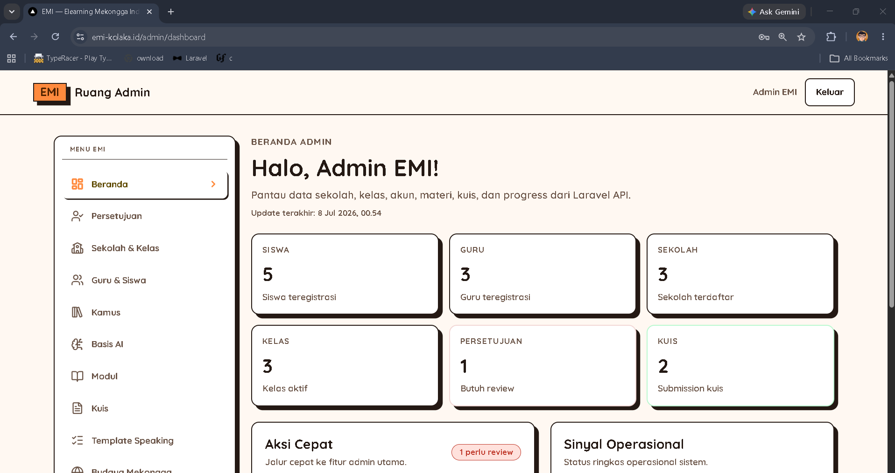

- URL: `/admin/dashboard`
- Tujuan: Melihat ringkasan kondisi EMI secara cepat.
- Yang dapat dilihat: Ringkasan sekolah, kelas, siswa, progres, dan kartu laporan jika tersedia.
- Yang dapat dilakukan: Membuka menu admin lain dari navigasi atau kartu dashboard.
- Langkah penggunaan:
  1. Login sebagai admin.
  2. Buka dashboard admin.
  3. Periksa ringkasan data.
  4. Buka menu lain jika perlu.
- Hasil yang diharapkan: Admin melihat gambaran umum sistem.
- Catatan penting: Jika data kosong, pastikan data demo atau data sekolah sudah tersedia.

#### Persetujuan Akun

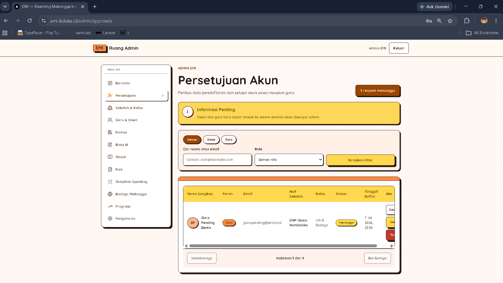

- URL: `/admin/approvals`
- Tujuan: Meninjau pendaftaran akun guru dan siswa.
- Yang dapat dilihat: Daftar permintaan, nama, email, role, status, sekolah, dan kelas tujuan.
- Yang dapat dilakukan: Mencari, memfilter, membuka detail, menyetujui, atau menolak akun.
- Langkah penggunaan:
  1. Buka Persetujuan Akun.
  2. Cari nama atau email pengguna.
  3. Periksa data pendaftaran.
  4. Klik Setujui jika benar atau Tolak jika tidak sesuai.
- Hasil yang diharapkan: Akun valid disetujui dan akun tidak valid ditolak.
- Catatan penting: Setujui akun hanya jika data sudah benar.

#### Detail Persetujuan

[Screenshot: Detail Persetujuan]

- URL: `/admin/approvals/[requestId]`
- Tujuan: Melihat satu permintaan pendaftaran secara lengkap.
- Yang dapat dilihat: Identitas pemohon, role, sekolah atau kelas tujuan, dan status permintaan.
- Yang dapat dilakukan: Menyetujui, menolak, atau kembali ke daftar persetujuan.
- Langkah penggunaan:
  1. Buka Persetujuan Akun.
  2. Pilih satu permintaan.
  3. Periksa detail pemohon.
  4. Setujui atau tolak sesuai hasil pemeriksaan.
- Hasil yang diharapkan: Satu permintaan selesai diproses.
- Catatan penting: Jika sudah diproses, tombol aksi mungkin tidak tersedia.

#### Sekolah & Kelas

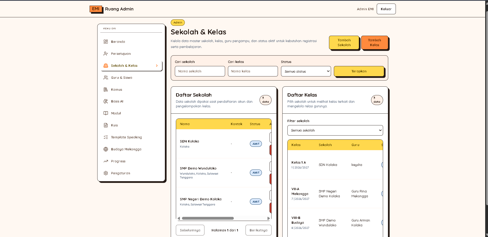

- URL: `/admin/schools-classes`
- Tujuan: Mengelola data sekolah dan kelas.
- Yang dapat dilihat: Daftar sekolah, daftar kelas, status, tahun ajaran, dan relasi sekolah.
- Yang dapat dilakukan: Menambah, mengubah, menonaktifkan, atau menghapus data jika tersedia.
- Langkah penggunaan:
  1. Buka Sekolah & Kelas.
  2. Pilih bagian sekolah atau kelas.
  3. Klik Tambah jika perlu membuat data baru.
  4. Isi data yang diminta.
  5. Klik Simpan.
- Hasil yang diharapkan: Data sekolah dan kelas tersimpan rapi.
- Catatan penting: Data yang masih dipakai mungkin tidak bisa dihapus langsung.

#### Detail Kelas

[Screenshot: Detail Kelas]

- URL: `/admin/classes/[classId]`
- Tujuan: Mengatur guru dan siswa dalam satu kelas.
- Yang dapat dilihat: Nama kelas, sekolah, guru aktif, dan daftar siswa.
- Yang dapat dilakukan: Menugaskan guru, mengganti guru, menambahkan siswa, atau memindahkan siswa jika tersedia.
- Langkah penggunaan:
  1. Buka Sekolah & Kelas.
  2. Pilih kelas.
  3. Periksa guru dan daftar siswa.
  4. Tambahkan guru atau siswa sesuai kebutuhan.
  5. Simpan perubahan.
- Hasil yang diharapkan: Kelas memiliki guru dan siswa yang sesuai.
- Catatan penting: Satu kelas hanya memiliki satu guru aktif, dan satu siswa hanya memiliki satu kelas aktif.

#### Guru & Siswa

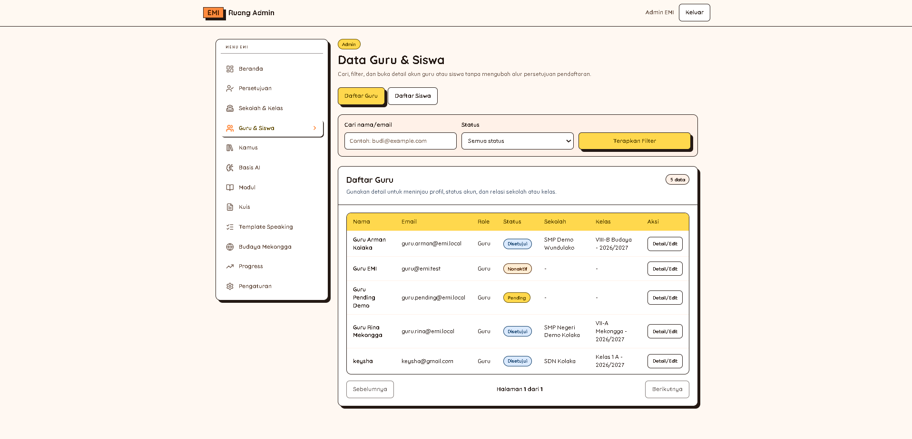

- URL: `/admin/users`
- Tujuan: Mengelola akun guru dan siswa.
- Yang dapat dilihat: Daftar pengguna, email, role, status, sekolah, dan kelas.
- Yang dapat dilakukan: Mencari, memfilter, membuka detail, mengubah data, atau mengubah status akun.
- Langkah penggunaan:
  1. Buka Guru & Siswa.
  2. Cari pengguna.
  3. Buka detail jika perlu.
  4. Ubah data atau status.
  5. Simpan perubahan.
- Hasil yang diharapkan: Data akun guru dan siswa selalu terbaru.
- Catatan penting: Hati-hati saat menonaktifkan akun karena pengguna mungkin tidak bisa login.

#### Detail User

[Screenshot: Detail User]

- URL: `/admin/users/[userId]`
- Tujuan: Melihat dan mengubah detail satu pengguna.
- Yang dapat dilihat: Profil pengguna, role, status akun, dan kelas terkait.
- Yang dapat dilakukan: Mengubah profil, mengubah status jika tersedia, dan menyimpan perubahan.
- Langkah penggunaan:
  1. Buka Guru & Siswa.
  2. Pilih pengguna.
  3. Periksa profil dan kelas.
  4. Ubah data yang diperlukan.
  5. Klik Simpan.
- Hasil yang diharapkan: Profil pengguna sesuai data terbaru.
- Catatan penting: Beberapa kolom mungkin hanya bisa dilihat.

#### Kamus

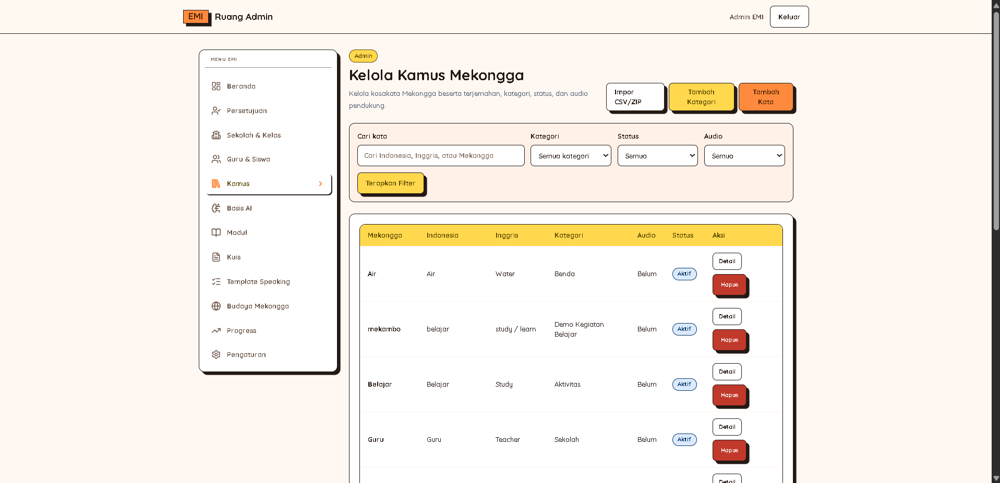

- URL: `/admin/dictionary`
- Tujuan: Mengelola kategori dan kata dalam kamus EMI.
- Yang dapat dilihat: Kata, kategori, arti, status, audio, dan contoh kalimat jika tersedia.
- Yang dapat dilakukan: Menambah kategori, menambah kata, mencari, memfilter, membuka detail, atau menghapus jika tersedia.
- Langkah penggunaan:
  1. Buka Kamus.
  2. Pilih Tambah Kategori atau Tambah Kata.
  3. Isi kata, arti, kategori, dan status.
  4. Unggah audio jika tersedia.
  5. Klik Simpan.
- Hasil yang diharapkan: Kata kamus siap dipakai sebagai bahan belajar.
- Catatan penting: Kosakata dan contoh kalimat perlu divalidasi narasumber.

#### Detail Kamus

[Screenshot: Detail Kamus]

- URL: `/admin/dictionary/[entryId]`
- Tujuan: Melihat dan mengubah satu entri kamus.
- Yang dapat dilihat: Kata, arti, kategori, audio, dan contoh kalimat.
- Yang dapat dilakukan: Mengubah data kata, mengunggah audio, melepas audio jika tersedia, dan menyimpan perubahan.
- Langkah penggunaan:
  1. Buka Kamus.
  2. Pilih kata.
  3. Periksa arti, kategori, audio, dan contoh kalimat.
  4. Ubah data jika perlu.
  5. Klik Simpan.
- Hasil yang diharapkan: Detail kata kamus benar dan lengkap.
- Catatan penting: Jika contoh kalimat belum muncul, periksa hasil import.

#### Import Kamus

[Screenshot: Import Kamus]

- URL: `/admin/dictionary/import`
- Tujuan: Mengimpor banyak data kamus atau contoh kalimat sekaligus.
- Yang dapat dilihat: Template file, preview data, riwayat import, dan daftar error jika ada.
- Yang dapat dilakukan: Mengunduh template, mengunggah CSV, melihat preview, dan mengonfirmasi import.
- Langkah penggunaan:
  1. Buka Import Kamus.
  2. Unduh template.
  3. Isi CSV sesuai format.
  4. Unggah CSV.
  5. Cek preview dan error.
  6. Konfirmasi import jika data benar.
- Hasil yang diharapkan: Data kamus atau contoh kalimat masuk ke sistem.
- Catatan penting: Jangan mengubah nama kolom template.

#### Basis AI

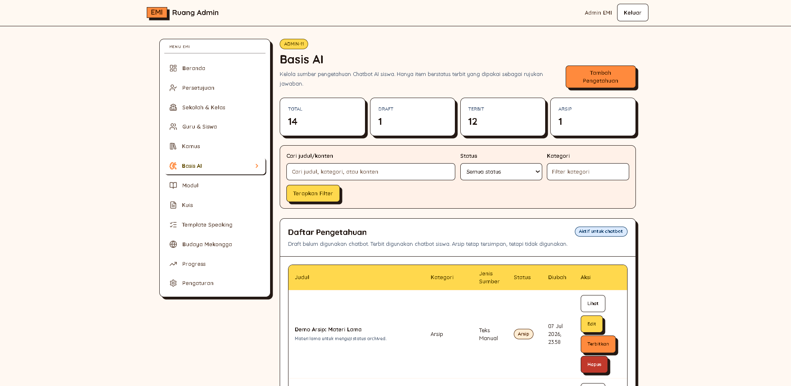

- URL: `/admin/knowledge-base`
- Tujuan: Mengelola pengetahuan yang dipakai chatbot AI.
- Yang dapat dilihat: Daftar pengetahuan, status, sumber, dan ringkasan isi.
- Yang dapat dilakukan: Menambah, mengedit, melihat preview, menerbitkan, mengarsipkan, atau menghapus jika tersedia.
- Langkah penggunaan:
  1. Buka Basis AI.
  2. Klik Tambah Pengetahuan.
  3. Isi judul dan isi pengetahuan.
  4. Simpan sebagai draft atau terbitkan.
  5. Cek status di daftar.
- Hasil yang diharapkan: Chatbot memiliki bahan jawaban yang benar.
- Catatan penting: Hanya pengetahuan yang diterbitkan yang dipakai chatbot.

#### Detail Basis AI

[Screenshot: Detail Basis AI]

- URL: `/admin/knowledge-base/[knowledgeId]`
- Tujuan: Melihat detail satu pengetahuan AI.
- Yang dapat dilihat: Judul, isi, sumber, status, dan potongan isi jika tersedia.
- Yang dapat dilakukan: Mengubah isi, menerbitkan, mengarsipkan, atau menghapus jika tersedia.
- Langkah penggunaan:
  1. Buka Basis AI.
  2. Pilih pengetahuan.
  3. Periksa isi dan status.
  4. Ubah atau terbitkan jika sudah sesuai.
  5. Simpan perubahan.
- Hasil yang diharapkan: Pengetahuan AI sesuai materi yang disetujui.
- Catatan penting: Detail tombol perlu dicek ulang saat review final.

#### Modul

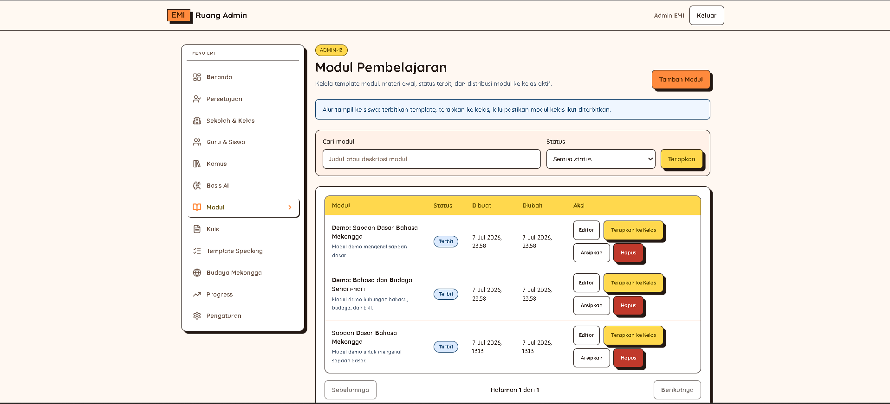

- URL: `/admin/modules`
- Tujuan: Mengelola template modul belajar.
- Yang dapat dilihat: Daftar template modul, status, dan jumlah materi.
- Yang dapat dilakukan: Menambah, mengedit, menerbitkan, mengarsipkan, menghapus, atau menerapkan template jika tersedia.
- Langkah penggunaan:
  1. Buka Modul.
  2. Klik Tambah Modul.
  3. Isi judul, deskripsi, level, status, dan urutan.
  4. Simpan modul.
  5. Buka edit untuk menambah materi.
- Hasil yang diharapkan: Template modul siap dipakai.
- Catatan penting: Modul perlu diterbitkan sebelum digunakan.

#### Edit Modul

[Screenshot: Edit Modul]

- URL: `/admin/modules/[moduleId]/edit`
- Tujuan: Mengubah modul dan materi di dalamnya.
- Yang dapat dilihat: Detail modul, daftar materi, dan media jika tersedia.
- Yang dapat dilakukan: Mengubah modul, menambah materi, mengedit materi, mengatur urutan, mengunggah media, dan menerbitkan.
- Langkah penggunaan:
  1. Buka Modul.
  2. Pilih modul.
  3. Perbarui data modul.
  4. Tambah atau ubah materi.
  5. Simpan perubahan.
- Hasil yang diharapkan: Modul memiliki materi lengkap dan urutan benar.
- Catatan penting: Cek ulang isi sebelum diterbitkan.

#### Kuis

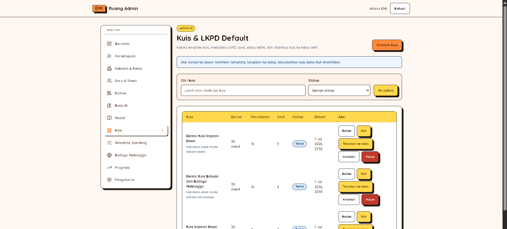

- URL: `/admin/quizzes`
- Tujuan: Mengelola template kuis.
- Yang dapat dilihat: Daftar template kuis, status, jumlah soal, dan pengaturan nilai jika tersedia.
- Yang dapat dilakukan: Menambah, membuka builder, menerbitkan, mengarsipkan, menghapus, atau menerapkan template jika tersedia.
- Langkah penggunaan:
  1. Buka Kuis.
  2. Klik Tambah Kuis.
  3. Isi judul, deskripsi, nilai kelulusan, dan pengaturan percobaan.
  4. Simpan kuis.
  5. Buka builder untuk menambah soal.
- Hasil yang diharapkan: Template kuis siap diisi soal.
- Catatan penting: Kuis yang sudah diterapkan ke kelas mungkin memiliki batasan perubahan.

#### Builder Kuis

[Screenshot: Builder Kuis]

- URL: `/admin/quizzes/[quizId]/builder`
- Tujuan: Mengelola soal dan pilihan jawaban kuis.
- Yang dapat dilihat: Detail kuis, pertanyaan, opsi jawaban, kunci, dan gambar jika tersedia.
- Yang dapat dilakukan: Menambah soal, mengubah soal, menentukan jawaban benar, mengunggah gambar, dan menerbitkan.
- Langkah penggunaan:
  1. Buka Kuis.
  2. Pilih kuis dan buka builder.
  3. Tambahkan pertanyaan.
  4. Isi opsi jawaban.
  5. Tandai jawaban benar.
  6. Simpan dan terbitkan jika siap.
- Hasil yang diharapkan: Kuis memiliki soal dan kunci jawaban benar.
- Catatan penting: Cek minimal opsi dan jawaban benar sebelum diterbitkan.

#### Speaking Exercises

[Screenshot: Speaking Exercises]

- URL: `/admin/speaking/exercises`
- Tujuan: Mengelola template latihan speaking.
- Yang dapat dilihat: Daftar latihan, status, dan audio referensi jika tersedia.
- Yang dapat dilakukan: Menambah, mengedit, mengarsipkan, dan mengunggah audio referensi.
- Langkah penggunaan:
  1. Buka Speaking Exercises.
  2. Klik Tambah.
  3. Isi judul, instruksi, dan teks latihan.
  4. Unggah audio jika ada.
  5. Simpan atau terbitkan.
- Hasil yang diharapkan: Guru dapat memakai template speaking.
- Catatan penting: Audio dan teks speaking perlu validasi.

#### Budaya Mekongga

[Screenshot: Budaya Mekongga]

- URL: `/admin/culture/templates`
- Tujuan: Mengelola konten budaya Mekongga.
- Yang dapat dilihat: Daftar konten, status, media, atau link jika tersedia.
- Yang dapat dilakukan: Menambah, mengedit, menerbitkan, mengarsipkan, atau menghapus jika tersedia.
- Langkah penggunaan:
  1. Buka Budaya Mekongga.
  2. Klik Tambah Konten Budaya.
  3. Isi judul, deskripsi, tipe konten, dan urutan.
  4. Tambahkan file atau URL jika tersedia.
  5. Simpan dan terbitkan jika sudah disetujui.
- Hasil yang diharapkan: Konten budaya tersedia sebagai bahan belajar.
- Catatan penting: Konten budaya harus divalidasi narasumber.

#### Progress Admin

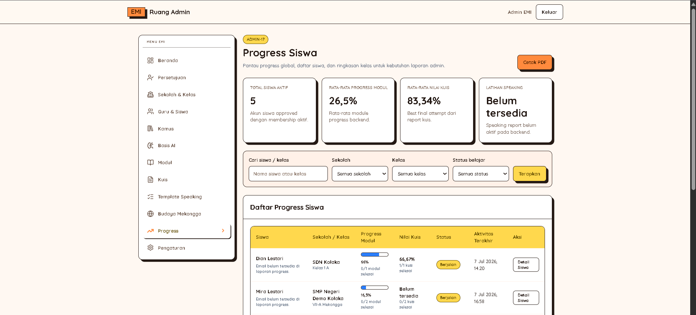

- URL: `/admin/progress`
- Tujuan: Melihat laporan progres sekolah, kelas, dan siswa.
- Yang dapat dilihat: Ringkasan progres, tabel sekolah, tabel kelas, dan tabel siswa.
- Yang dapat dilakukan: Memfilter laporan, membuka detail, export, atau print jika tersedia.
- Langkah penggunaan:
  1. Buka Progress Admin.
  2. Pilih filter jika tersedia.
  3. Periksa ringkasan dan tabel progres.
  4. Buka detail kelas atau siswa jika perlu.
- Hasil yang diharapkan: Admin dapat memantau perkembangan belajar.
- Catatan penting: Data progres tergantung aktivitas siswa.

#### Detail Progress Kelas

[Screenshot: Detail Progress Kelas]

- URL: `/admin/progress/classes/[classId]`
- Tujuan: Melihat progres satu kelas.
- Yang dapat dilihat: Ringkasan kelas, daftar siswa, progres modul, dan kuis.
- Yang dapat dilakukan: Memfilter periode, membuka detail siswa, export, atau print jika tersedia.
- Langkah penggunaan:
  1. Buka Progress Admin.
  2. Pilih kelas.
  3. Periksa progres siswa.
  4. Buka detail siswa jika perlu.
- Hasil yang diharapkan: Admin mengetahui progres satu kelas.
- Catatan penting: Jika kosong, cek apakah siswa sudah belajar.

#### Detail Progress Siswa

[Screenshot: Detail Progress Siswa]

- URL: `/admin/progress/students/[studentId]`
- Tujuan: Melihat progres satu siswa.
- Yang dapat dilihat: Profil siswa, progres modul, progres kuis, dan skor.
- Yang dapat dilakukan: Memfilter periode atau mencetak laporan jika tersedia.
- Langkah penggunaan:
  1. Buka Progress Admin.
  2. Pilih siswa.
  3. Periksa modul, kuis, dan skor.
  4. Cetak laporan jika diperlukan.
- Hasil yang diharapkan: Admin memahami perkembangan siswa tertentu.
- Catatan penting: Perhitungan progres perlu dicek saat review final.

#### Pengaturan Admin

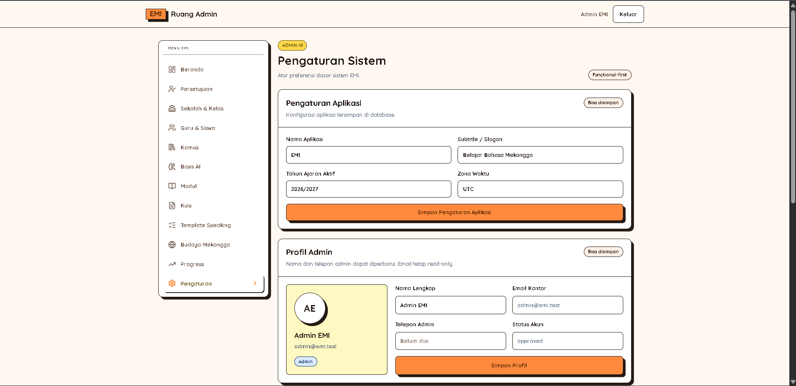

- URL: `/admin/settings`
- Tujuan: Mengelola Profil Admin, Banner Login, Ubah Password, dan Aktivitas terbaru.
- Yang dapat dilihat: Profil Admin, preview Banner Login, dan Aktivitas terbaru.
- Yang dapat dilakukan: Menyimpan Profil Admin, Banner Login, dan Ubah Password.
- Langkah penggunaan:
  1. Buka Pengaturan Admin.
  2. Pilih bagian yang ingin diubah.
  3. Isi data baru atau unggah banner.
  4. Klik Simpan.
  5. Cek hasilnya.
- Hasil yang diharapkan: Pengaturan sistem tersimpan.
- Catatan penting: Jangan menampilkan password saat review atau screenshot.

### 4.6 Catatan Admin

Beberapa data bahasa dan budaya perlu validasi narasumber sebelum digunakan untuk demo resmi atau penggunaan sekolah.

## 5. Panduan Guru

### 5.1 Tentang Role Guru

Guru adalah pengguna yang mengelola kegiatan belajar di kelasnya. Guru dapat melihat kelas yang diajar, mengelola siswa, mengelola modul atau materi kelas, mengelola kuis, melihat hasil kuis, membuat target speaking, meninjau hasil speaking, dan melihat progress siswa.

Guru hanya melihat data yang berhubungan dengan kelas yang diajar.

### 5.2 Akun Demo Guru

Contoh email akun demo guru:

`guru.rina@emi.local`

`guru.arman@emi.local`

Password mengikuti password demo yang diberikan pengelola sistem.

### 5.3 Cara Login Guru

1. Buka halaman login.
2. Masukkan email dan password guru.
3. Klik Masuk.
4. Sistem akan membuka dashboard guru.

### 5.4 Ringkasan Alur Kerja Guru

Login → Dashboard → Pilih Kelas → Kelola Siswa → Kelola Modul/Materi → Kelola Kuis → Review Speaking → Pantau Progress.

### 5.5 Panduan Tiap Menu Guru

#### Dashboard Guru

- URL: `/teacher/dashboard`
- Tujuan: Melihat ringkasan aktivitas mengajar.
- Yang dapat dilihat: Ringkasan kelas, siswa, modul, kuis, dan progress jika tersedia.
- Yang dapat dilakukan: Membuka menu guru lain dan mengecek data kelas.
- Langkah penggunaan:
  1. Login sebagai guru.
  2. Buka dashboard guru.
  3. Periksa ringkasan kelas dan siswa.
  4. Pilih menu lain jika perlu.
- Hasil yang diharapkan: Guru melihat gambaran umum kegiatan kelas.
- Catatan penting: Jika kelas kosong, hubungi admin.

#### Kelas Guru

- URL: `/teacher/classes`
- Tujuan: Melihat daftar kelas yang diajar.
- Yang dapat dilihat: Nama kelas, sekolah, jumlah siswa, dan status kelas.
- Yang dapat dilakukan: Membuka detail kelas dan bagian siswa, modul, kuis, atau budaya.
- Langkah penggunaan:
  1. Buka Kelas Guru.
  2. Cari kelas.
  3. Klik kelas.
  4. Pilih bagian yang ingin dikelola.
- Hasil yang diharapkan: Guru dapat memilih kelas yang akan dikelola.
- Catatan penting: Guru hanya melihat kelas yang ditugaskan admin.

#### Detail Kelas Guru

[Screenshot: Detail Kelas Guru]

- URL: `/teacher/classes/[classId]`
- Tujuan: Melihat ringkasan satu kelas.
- Yang dapat dilihat: Detail kelas, sekolah, dan statistik siswa, modul, atau kuis.
- Yang dapat dilakukan: Membuka siswa, modul, kuis, atau budaya kelas.
- Langkah penggunaan:
  1. Buka Kelas Guru.
  2. Pilih kelas.
  3. Periksa ringkasan.
  4. Buka bagian yang dibutuhkan.
- Hasil yang diharapkan: Guru memahami kondisi kelas.
- Catatan penting: Jika tidak bisa dibuka, pastikan guru ditugaskan ke kelas tersebut.

#### Siswa Kelas

[Screenshot: Siswa Kelas]

- URL: `/teacher/classes/[classId]/students`
- Tujuan: Melihat daftar siswa dalam satu kelas.
- Yang dapat dilihat: Nama siswa, status, dan progress ringkas jika tersedia.
- Yang dapat dilakukan: Mencari, memfilter, dan membuka detail siswa.
- Langkah penggunaan:
  1. Buka detail kelas.
  2. Pilih Siswa.
  3. Cari siswa.
  4. Buka detail jika perlu.
- Hasil yang diharapkan: Guru mengetahui daftar siswa di kelasnya.
- Catatan penting: Jika siswa belum muncul, minta admin memeriksa penempatan siswa.

#### Modul Kelas

[Screenshot: Modul Kelas]

- URL: `/teacher/classes/[classId]/modules`
- Tujuan: Mengelola modul belajar untuk kelas tertentu.
- Yang dapat dilihat: Daftar modul kelas, status, urutan, dan materi jika tersedia.
- Yang dapat dilakukan: Menambah, memakai template, mengedit, menerbitkan, mengarsipkan, atau mengatur urutan jika tersedia.
- Langkah penggunaan:
  1. Buka detail kelas.
  2. Pilih Modul.
  3. Klik Tambah atau pilih template.
  4. Isi data modul.
  5. Simpan dan terbitkan jika siap.
- Hasil yang diharapkan: Siswa dapat melihat modul yang diterbitkan.
- Catatan penting: Modul draft biasanya belum terlihat oleh siswa.

#### Kuis Kelas

[Screenshot: Kuis Kelas]

- URL: `/teacher/classes/[classId]/quizzes`
- Tujuan: Mengelola kuis untuk kelas tertentu.
- Yang dapat dilihat: Daftar kuis, status, jadwal, dan pengaturan percobaan.
- Yang dapat dilakukan: Menambah kuis, memakai template, membuka builder, melihat hasil, dan menerbitkan.
- Langkah penggunaan:
  1. Buka detail kelas.
  2. Pilih Kuis.
  3. Klik Tambah Kuis atau pilih template.
  4. Isi pengaturan kuis.
  5. Buka builder untuk menambah soal.
- Hasil yang diharapkan: Siswa dapat mengerjakan kuis yang diterbitkan.
- Catatan penting: Kuis yang sudah dikerjakan siswa mungkin tidak bisa diubah bebas.

#### Budaya Kelas

[Screenshot: Budaya Kelas]

- URL: `/teacher/classes/[classId]/culture`
- Tujuan: Mengelola konten budaya untuk kelas tertentu.
- Yang dapat dilihat: Konten budaya kelas, status, file, atau URL jika tersedia.
- Yang dapat dilakukan: Menambah, mengedit, menerbitkan, mengarsipkan, atau menghapus jika tersedia.
- Langkah penggunaan:
  1. Buka detail kelas.
  2. Pilih Budaya.
  3. Tambah atau pilih konten.
  4. Isi data konten.
  5. Simpan dan terbitkan jika siap.
- Hasil yang diharapkan: Siswa dapat melihat konten budaya kelas.
- Catatan penting: Halaman ini mungkin diarahkan ke Budaya Guru.

#### Siswa Guru

- URL: `/teacher/students`
- Tujuan: Melihat semua siswa yang diajar guru.
- Yang dapat dilihat: Daftar siswa, kelas, sekolah, dan progress ringkas.
- Yang dapat dilakukan: Mencari, memfilter, dan membuka detail siswa.
- Langkah penggunaan:
  1. Buka Siswa Guru.
  2. Cari siswa.
  3. Periksa kelas dan progress.
  4. Buka detail jika perlu.
- Hasil yang diharapkan: Guru dapat menemukan siswa dari kelas yang diajar.
- Catatan penting: Guru hanya melihat siswa dari kelasnya.

#### Detail Siswa Guru

[Screenshot: Detail Siswa Guru]

- URL: `/teacher/students/[studentId]`
- Tujuan: Melihat detail dan progress satu siswa.
- Yang dapat dilihat: Profil siswa, kelas, progress modul, dan progress kuis.
- Yang dapat dilakukan: Membuka laporan atau detail progress jika tersedia.
- Langkah penggunaan:
  1. Buka Siswa Guru.
  2. Pilih siswa.
  3. Periksa profil dan progress.
  4. Buka laporan jika tersedia.
- Hasil yang diharapkan: Guru memahami perkembangan siswa tertentu.
- Catatan penting: Data siswa di luar kelas guru tidak seharusnya bisa dibuka.

#### Laporan Progress Guru

- URL: `/teacher/reports/progress`
- Tujuan: Melihat laporan progress kelas dan siswa.
- Yang dapat dilihat: Progress kelas, progress siswa, dan filter periode jika tersedia.
- Yang dapat dilakukan: Memfilter dan export jika tersedia.
- Langkah penggunaan:
  1. Buka Laporan Progress Guru.
  2. Pilih filter jika tersedia.
  3. Periksa tabel progress.
  4. Export jika diperlukan.
- Hasil yang diharapkan: Guru dapat memantau hasil belajar siswa.
- Catatan penting: Progress muncul jika siswa sudah belajar atau mengerjakan kuis.

#### Modul Guru

- URL: `/teacher/modules`
- Tujuan: Mengelola semua modul kelas milik guru.
- Yang dapat dilihat: Daftar modul, status, dan kelas terkait.
- Yang dapat dilakukan: Memfilter, mengedit, menerbitkan, mengarsipkan, atau membuka edit materi.
- Langkah penggunaan:
  1. Buka Modul Guru.
  2. Pilih modul.
  3. Periksa kelas dan status.
  4. Klik Edit jika perlu.
  5. Terbitkan jika siap.
- Hasil yang diharapkan: Guru dapat mengelola modul lintas kelas.
- Catatan penting: Media Guru mungkin diarahkan ke halaman ini.

#### Edit Modul Guru

[Screenshot: Edit Modul Guru]

- URL: `/teacher/modules/[classModuleId]/edit`
- Tujuan: Mengubah modul kelas dan daftar materinya.
- Yang dapat dilihat: Detail modul, daftar materi, dan status modul.
- Yang dapat dilakukan: Mengubah judul, deskripsi, status, urutan, menambah materi, dan menerbitkan.
- Langkah penggunaan:
  1. Buka Modul Guru.
  2. Pilih modul.
  3. Ubah data modul.
  4. Tambah atau edit materi.
  5. Simpan perubahan.
- Hasil yang diharapkan: Modul kelas tersusun rapi.
- Catatan penting: Tombol terbitkan biasanya muncul jika modul belum diterbitkan.

#### Edit Lesson Guru

[Screenshot: Edit Lesson Guru]

- URL: `/teacher/modules/[classModuleId]/lessons/[classLessonId]/edit`
- Tujuan: Mengubah satu materi di dalam modul kelas.
- Yang dapat dilihat: Judul materi, isi materi, media, dan status.
- Yang dapat dilakukan: Mengubah judul, isi, media, dan menerbitkan materi.
- Langkah penggunaan:
  1. Buka Edit Modul Guru.
  2. Pilih materi.
  3. Ubah judul dan isi.
  4. Unggah media jika perlu.
  5. Simpan dan terbitkan.
- Hasil yang diharapkan: Materi dapat dibaca siswa dengan isi yang benar.
- Catatan penting: Gunakan file media ringan.

#### Kuis Guru

- URL: `/teacher/quizzes`
- Tujuan: Mengelola semua kuis kelas milik guru.
- Yang dapat dilihat: Daftar kuis, status, jadwal, dan jumlah percobaan jika tersedia.
- Yang dapat dilakukan: Membuat kuis, membuka builder, dan melihat hasil.
- Langkah penggunaan:
  1. Buka Kuis Guru.
  2. Klik Buat Kuis.
  3. Pilih kelas jika diminta.
  4. Isi pengaturan kuis.
  5. Simpan lalu buka builder.
- Hasil yang diharapkan: Guru dapat membuat kuis kelas.
- Catatan penting: Jika tidak ada kelas, tombol buat kuis mungkin tidak aktif.

#### Builder Kuis Guru

[Screenshot: Builder Kuis Guru]

- URL: `/teacher/quizzes/[classQuizId]/builder`
- Tujuan: Mengedit kuis dan soal untuk kelas.
- Yang dapat dilihat: Detail kuis, pertanyaan, pilihan jawaban, dan gambar jika tersedia.
- Yang dapat dilakukan: Menyimpan kuis, menambah soal, mengedit soal, menambah opsi, mengunggah gambar, dan menerbitkan.
- Langkah penggunaan:
  1. Buka Kuis Guru.
  2. Pilih kuis dan buka builder.
  3. Tambahkan pertanyaan.
  4. Isi opsi dan jawaban benar.
  5. Simpan dan terbitkan jika siap.
- Hasil yang diharapkan: Kuis memiliki soal yang dapat dikerjakan siswa.
- Catatan penting: Jika sudah dikerjakan siswa, soal mungkin terkunci.

#### Hasil Kuis Guru

[Screenshot: Hasil Kuis Guru]

- URL: `/teacher/quizzes/[classQuizId]/results`
- Tujuan: Melihat hasil kuis siswa.
- Yang dapat dilihat: Attempt, nama siswa, skor, status, dan detail jawaban jika tersedia.
- Yang dapat dilakukan: Mencari siswa dan membuka detail hasil.
- Langkah penggunaan:
  1. Buka Kuis Guru.
  2. Pilih kuis.
  3. Buka Hasil Kuis.
  4. Cari siswa jika perlu.
  5. Buka detail jawaban.
- Hasil yang diharapkan: Guru mengetahui hasil kuis siswa.
- Catatan penting: Tidak terlihat fitur mengubah nilai dari halaman ini.

#### Budaya Guru

[Screenshot: Budaya Guru]

- URL: `/teacher/culture`
- Tujuan: Mengelola konten budaya untuk kelas guru.
- Yang dapat dilihat: Daftar konten budaya, status, media, link, dan kelas terkait jika tersedia.
- Yang dapat dilakukan: Menambah, mengedit, menerbitkan, mengarsipkan, atau menghapus dari kelas.
- Langkah penggunaan:
  1. Buka Budaya Guru.
  2. Pilih kelas jika tersedia.
  3. Tambah atau pilih konten.
  4. Isi data konten.
  5. Simpan dan terbitkan.
- Hasil yang diharapkan: Konten budaya siap dilihat siswa.
- Catatan penting: Jika guru mengajar beberapa kelas, cek pilihan kelas dengan teliti.

#### Target Speaking Guru

- URL: `/teacher/speaking/exercises`
- Tujuan: Membuat dan mengelola target latihan speaking.
- Yang dapat dilihat: Template speaking, target speaking kelas, status, dan audio referensi jika tersedia.
- Yang dapat dilakukan: Membuat target, memilih template, mengedit, mengarsipkan, dan mengunggah audio.
- Langkah penggunaan:
  1. Buka Target Speaking Guru.
  2. Klik Buat Target.
  3. Pilih kelas dan template jika tersedia.
  4. Isi instruksi dan teks latihan.
  5. Simpan dan terbitkan jika siap.
- Hasil yang diharapkan: Siswa dapat mengerjakan latihan speaking.
- Catatan penting: Teks dan audio speaking perlu validasi.

#### Hasil Speaking Guru

- URL: `/teacher/speaking/results`
- Tujuan: Meninjau hasil latihan speaking siswa.
- Yang dapat dilihat: Attempt siswa, skor AI jika tersedia, audio, transkrip, dan feedback.
- Yang dapat dilakukan: Memilih attempt, mendengarkan audio, menulis feedback, dan menyimpan feedback.
- Langkah penggunaan:
  1. Buka Hasil Speaking Guru.
  2. Pilih attempt siswa.
  3. Dengarkan audio dan baca hasil.
  4. Tulis feedback.
  5. Simpan feedback.
- Hasil yang diharapkan: Siswa mendapat masukan dari guru.
- Catatan penting: Guru hanya meninjau siswa dari kelasnya.

#### Media Guru

[Screenshot: Media Guru]

- URL: `/teacher/media`
- Tujuan: Mengunggah media pembelajaran jika halaman tersedia.
- Yang dapat dilihat: Form upload media jika halaman aktif.
- Yang dapat dilakukan: Mengunggah file media jika fitur tersedia.
- Langkah penggunaan:
  1. Buka Media Guru.
  2. Pilih file jika form upload muncul.
  3. Isi keterangan.
  4. Klik Upload Media.
  5. Gunakan media pada materi jika tersedia.
- Hasil yang diharapkan: Media dapat dipakai untuk bahan ajar.
- Catatan penting: Halaman ini kemungkinan diarahkan ke Modul Guru.

#### Profil Guru

- URL: `/teacher/profile`
- Tujuan: Melihat dan memperbarui profil guru.
- Yang dapat dilihat: Nama, email, role, status, dan nomor telepon jika tersedia.
- Yang dapat dilakukan: Mengubah nama, nomor telepon, dan menyimpan profil.
- Langkah penggunaan:
  1. Buka Profil Guru.
  2. Periksa data profil.
  3. Ubah data yang boleh diubah.
  4. Klik Simpan Profil.
- Hasil yang diharapkan: Profil guru tersimpan sesuai data terbaru.
- Catatan penting: Email dan status biasanya hanya bisa dilihat.

### 5.6 Catatan Guru

Data bahasa dan budaya sebaiknya mengikuti arahan admin dan narasumber.

## 6. Panduan Siswa

### 6.1 Tentang Role Siswa

Siswa adalah pengguna yang belajar di EMI. Siswa dapat membuka modul, membaca materi, mencari kata di kamus, latihan speaking, mengerjakan kuis, memakai chatbot, dan melihat progress belajar.

Siswa hanya melihat materi dari kelasnya.

### 6.2 Akun Demo Siswa

Contoh email akun demo siswa:

`siswa.nanda@emi.local`

`siswa.mira@emi.local`

`siswa.rafi@emi.local`

Password mengikuti password demo yang diberikan pengelola sistem.

### 6.3 Cara Login Siswa

1. Buka halaman login.
2. Masukkan email dan password siswa.
3. Klik Masuk.
4. Sistem akan membuka dashboard siswa.

### 6.4 Ringkasan Alur Belajar Siswa

Login → Dashboard → Buka Modul → Baca Materi → Kerjakan Kuis → Latihan Speaking → Gunakan Kamus/Chatbot → Lihat Progress.

### 6.5 Panduan Tiap Menu Siswa

#### Dashboard Siswa

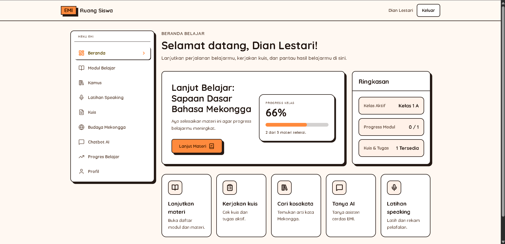

- URL: `/student/dashboard`
- Tujuan: Melihat ringkasan belajar.
- Yang dapat dilihat: Ringkasan modul, kuis, progress, dan kelas aktif.
- Yang dapat dilakukan: Membuka menu belajar lain.
- Langkah penggunaan:
  1. Login sebagai siswa.
  2. Buka dashboard siswa.
  3. Lihat ringkasan belajar.
  4. Pilih menu yang ingin dibuka.
- Hasil yang diharapkan: Siswa tahu kegiatan belajar yang perlu dilanjutkan.
- Catatan penting: Jika kelas belum muncul, hubungi guru atau admin.

#### Modul Belajar

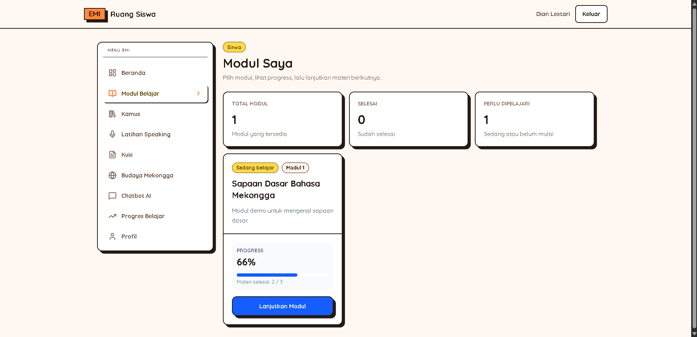

- URL: `/student/modules`
- Tujuan: Melihat daftar modul belajar.
- Yang dapat dilihat: Daftar modul, status progress, judul, dan ringkasan jika tersedia.
- Yang dapat dilakukan: Membuka detail modul dan mencari jika tersedia.
- Langkah penggunaan:
  1. Buka Modul Belajar.
  2. Pilih modul.
  3. Klik modul untuk membuka detail.
- Hasil yang diharapkan: Siswa dapat memilih modul belajar.
- Catatan penting: Modul yang belum diterbitkan guru tidak terlihat.

#### Detail Modul

[Screenshot: Detail Modul]

- URL: `/student/modules/[moduleId]`
- Tujuan: Melihat isi modul dan daftar materi.
- Yang dapat dilihat: Judul, deskripsi, daftar materi, dan progress modul.
- Yang dapat dilakukan: Memulai modul, membuka materi, dan melanjutkan belajar.
- Langkah penggunaan:
  1. Buka Modul Belajar.
  2. Pilih modul.
  3. Klik Mulai Modul jika tersedia.
  4. Pilih materi.
- Hasil yang diharapkan: Siswa dapat masuk ke materi modul.
- Catatan penting: Tombol mulai mungkin tidak aktif jika modul sudah dimulai.

#### Detail Lesson

[Screenshot: Detail Lesson]

- URL: `/student/lessons/[lessonId]`
- Tujuan: Membaca materi belajar.
- Yang dapat dilihat: Judul, isi materi, media, dan status progress.
- Yang dapat dilakukan: Membaca materi, membuka media, dan menandai selesai.
- Langkah penggunaan:
  1. Buka detail modul.
  2. Pilih materi.
  3. Baca sampai selesai.
  4. Klik Tandai Selesai jika tersedia.
- Hasil yang diharapkan: Materi tercatat sudah dipelajari.
- Catatan penting: Pastikan koneksi internet stabil.

#### Kamus

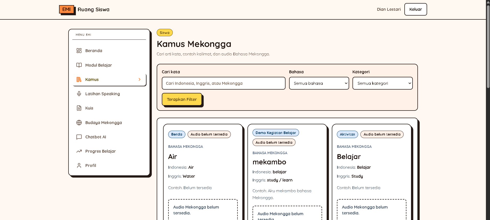

- URL: `/student/dictionary`
- Tujuan: Mencari kata dalam kamus Mekongga.
- Yang dapat dilihat: Daftar kata, kategori, arti, audio, dan contoh kalimat jika tersedia.
- Yang dapat dilakukan: Mencari kata, memfilter kategori, dan membuka detail kata.
- Langkah penggunaan:
  1. Buka Kamus.
  2. Ketik kata.
  3. Pilih kata dari daftar.
  4. Buka detail untuk arti lengkap.
- Hasil yang diharapkan: Siswa menemukan arti kata.
- Catatan penting: Jika kata belum ada, tanyakan kepada guru.

#### Detail Kamus

[Screenshot: Detail Kamus]

- URL: `/student/dictionary/[entryId]`
- Tujuan: Melihat detail satu kata kamus.
- Yang dapat dilihat: Kata, arti, kategori, audio, dan contoh kalimat.
- Yang dapat dilakukan: Membaca arti, memutar audio, dan kembali ke daftar kamus.
- Langkah penggunaan:
  1. Buka Kamus.
  2. Pilih kata.
  3. Baca arti dan contoh kalimat.
  4. Putar audio jika tersedia.
- Hasil yang diharapkan: Siswa memahami arti kata dan contoh pemakaian.
- Catatan penting: Tidak semua kata memiliki audio.

#### Latihan Speaking

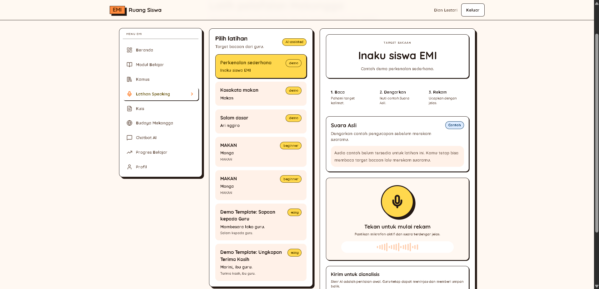

- URL: `/student/speaking`
- Tujuan: Berlatih mengucapkan kata atau kalimat.
- Yang dapat dilihat: Daftar latihan, instruksi, audio contoh, dan riwayat jika tersedia.
- Yang dapat dilakukan: Memilih latihan, mulai rekaman, berhenti rekaman, dan mengirim rekaman.
- Langkah penggunaan:
  1. Buka Latihan Speaking.
  2. Pilih latihan.
  3. Izinkan akses mikrofon jika diminta.
  4. Mulai rekaman.
  5. Ucapkan kalimat dengan jelas.
  6. Berhenti lalu kirim.
- Hasil yang diharapkan: Rekaman speaking terkirim.
- Catatan penting: Butuh mikrofon dan internet stabil.

#### Hasil Speaking

[Screenshot: Hasil Speaking]

- URL: `/student/speaking/results`
- Tujuan: Melihat hasil latihan speaking.
- Yang dapat dilihat: Riwayat latihan, skor, feedback, dan status analisis jika tersedia.
- Yang dapat dilakukan: Membuka detail hasil dan membaca feedback.
- Langkah penggunaan:
  1. Buka Hasil Speaking.
  2. Pilih hasil latihan.
  3. Lihat skor dan feedback.
  4. Gunakan feedback untuk latihan berikutnya.
- Hasil yang diharapkan: Siswa tahu hasil latihan speaking.
- Catatan penting: Jika analisis gagal, coba latihan ulang atau tanya guru.

#### Kuis

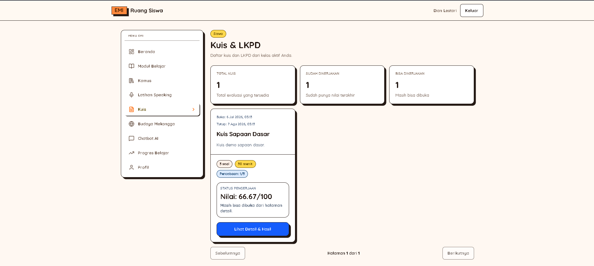

- URL: `/student/quizzes`
- Tujuan: Melihat daftar kuis yang bisa dikerjakan.
- Yang dapat dilihat: Daftar kuis, jadwal, jumlah percobaan, dan status.
- Yang dapat dilakukan: Membuka detail, melanjutkan kuis, atau melihat hasil jika tersedia.
- Langkah penggunaan:
  1. Buka Kuis.
  2. Pilih kuis.
  3. Buka detail kuis.
  4. Ikuti instruksi.
- Hasil yang diharapkan: Siswa dapat memilih kuis.
- Catatan penting: Kuis bisa memiliki jadwal dan batas percobaan.

#### Detail Kuis

[Screenshot: Detail Kuis]

- URL: `/student/quizzes/[quizId]`
- Tujuan: Melihat informasi kuis sebelum mulai.
- Yang dapat dilihat: Judul, instruksi, jumlah soal, batas percobaan, dan jadwal jika tersedia.
- Yang dapat dilakukan: Membaca instruksi dan memulai kuis.
- Langkah penggunaan:
  1. Buka Kuis.
  2. Pilih kuis.
  3. Baca instruksi.
  4. Klik Mulai Kuis jika siap.
- Hasil yang diharapkan: Siswa siap mengerjakan kuis.
- Catatan penting: Jangan mulai jika koneksi tidak stabil.

#### Attempt Kuis

[Screenshot: Attempt Kuis]

- URL: `/student/quizzes/[quizId]/attempt`
- Tujuan: Mengerjakan soal kuis.
- Yang dapat dilihat: Pertanyaan, pilihan jawaban, dan navigasi soal.
- Yang dapat dilakukan: Memilih jawaban, pindah soal, dan mengirim jawaban.
- Langkah penggunaan:
  1. Baca pertanyaan.
  2. Pilih jawaban.
  3. Klik Berikutnya.
  4. Periksa jawaban.
  5. Klik Submit atau Kirim jika yakin.
- Hasil yang diharapkan: Jawaban kuis terkirim.
- Catatan penting: Jangan menutup halaman saat kuis berjalan.

#### Hasil Kuis

[Screenshot: Hasil Kuis]

- URL: `/student/quizzes/[quizId]/result`
- Tujuan: Melihat hasil kuis.
- Yang dapat dilihat: Skor, status lulus, dan jawaban benar atau salah jika diizinkan guru.
- Yang dapat dilakukan: Membaca hasil, kembali ke daftar kuis, atau mengulang jika tersedia.
- Langkah penggunaan:
  1. Selesaikan kuis.
  2. Buka hasil.
  3. Lihat skor dan status.
  4. Baca pembahasan jika tersedia.
- Hasil yang diharapkan: Siswa mengetahui nilai kuis.
- Catatan penting: Detail jawaban mungkin disembunyikan.

#### Budaya Mekongga

[Screenshot: Budaya Mekongga]

- URL: `/student/culture`
- Tujuan: Melihat konten budaya Mekongga.
- Yang dapat dilihat: Konten budaya, teks, media, atau link jika tersedia.
- Yang dapat dilakukan: Membaca konten dan membuka media atau link.
- Langkah penggunaan:
  1. Buka Budaya Mekongga.
  2. Pilih konten.
  3. Baca isi konten.
  4. Buka media jika tersedia.
- Hasil yang diharapkan: Siswa mengenal budaya Mekongga.
- Catatan penting: Ikuti arahan guru.

#### Chatbot AI

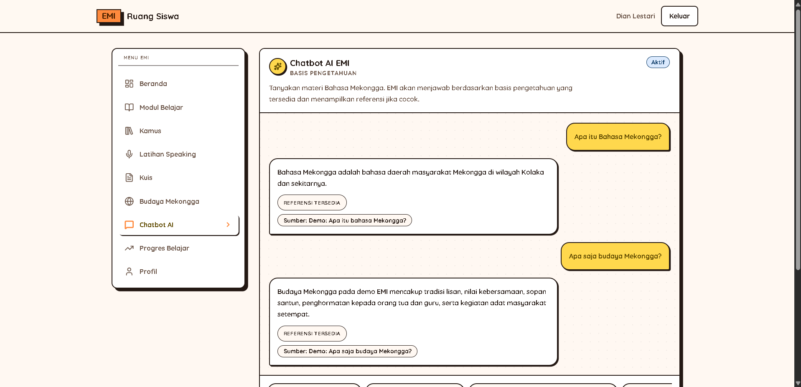

- URL: `/student/chatbot`
- Tujuan: Bertanya tentang materi, kamus, atau informasi belajar.
- Yang dapat dilihat: Kolom chat, jawaban chatbot, referensi jika tersedia, dan saran pertanyaan.
- Yang dapat dilakukan: Menulis pertanyaan, mengirim pertanyaan, membuka referensi, dan memilih saran pertanyaan.
- Langkah penggunaan:
  1. Buka Chatbot AI.
  2. Ketik pertanyaan dengan jelas dan sopan.
  3. Klik Kirim.
  4. Baca jawaban.
  5. Tanyakan kepada guru jika belum jelas.
- Hasil yang diharapkan: Siswa mendapat bantuan belajar.
- Catatan penting: Chatbot membantu belajar, tetapi arahan guru tetap utama.

#### Progress Belajar

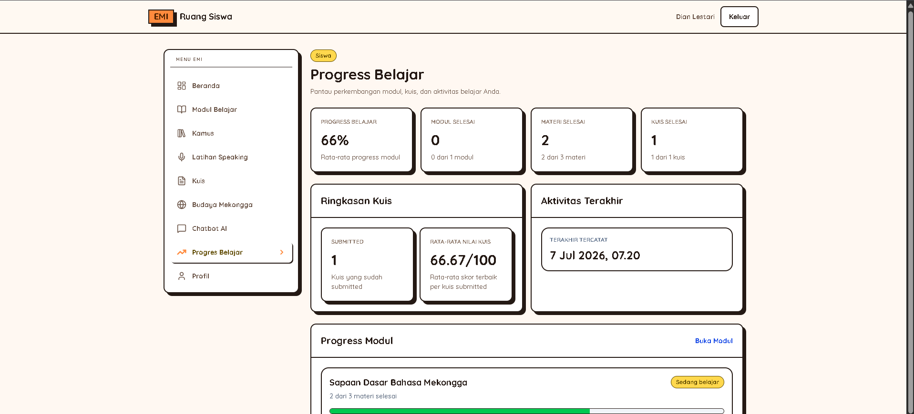

- URL: `/student/progress`
- Tujuan: Melihat perkembangan belajar sendiri.
- Yang dapat dilihat: Progress modul, materi, skor kuis, dan ringkasan belajar.
- Yang dapat dilakukan: Melihat progress, memfilter periode, atau mencetak laporan jika tersedia.
- Langkah penggunaan:
  1. Buka Progress Belajar.
  2. Lihat ringkasan progress.
  3. Periksa modul, materi, dan kuis.
  4. Gunakan informasi untuk melanjutkan belajar.
- Hasil yang diharapkan: Siswa tahu bagian yang sudah dan belum selesai.
- Catatan penting: Progress bisa butuh waktu untuk berubah.

#### Profil Siswa

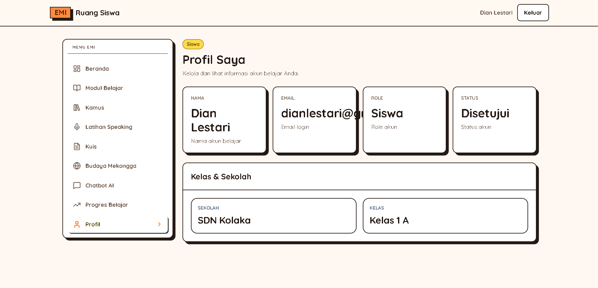

- URL: `/student/profile`
- Tujuan: Melihat dan memperbarui profil siswa.
- Yang dapat dilihat: Nama, email, role, status, kelas aktif, dan nomor telepon jika tersedia.
- Yang dapat dilakukan: Mengubah data yang boleh diubah dan menyimpan profil.
- Langkah penggunaan:
  1. Buka Profil Siswa.
  2. Periksa data profil.
  3. Ubah data yang boleh diubah.
  4. Klik Simpan Profil.
- Hasil yang diharapkan: Profil siswa sesuai data terbaru.
- Catatan penting: Email dan status biasanya hanya bisa dilihat.

### 6.6 Catatan Siswa

Ikuti arahan guru, pastikan koneksi internet stabil, izinkan akses mikrofon saat speaking, dan gunakan bahasa sopan saat bertanya ke chatbot.

## 7. FAQ

### 7.1 FAQ Admin

#### Bagaimana jika guru belum bisa login?

Periksa apakah akun guru sudah disetujui di Persetujuan Akun. Jika sudah, cek status akun di Guru & Siswa.

#### Bagaimana cara menambahkan siswa ke kelas?

Buka Sekolah & Kelas, pilih kelas, lalu tambahkan siswa dari Detail Kelas. Pastikan akun siswa sudah aktif.

#### Mengapa data contoh kalimat tidak muncul?

Periksa Detail Kamus dan riwayat Import Kamus. Pastikan contoh kalimat terhubung ke kata yang benar.

#### Bagaimana cara mengubah banner login?

Buka Pengaturan Admin, unggah banner baru, aktifkan jika ada pilihan, lalu simpan.

#### Bagaimana cara melihat progress siswa?

Buka Progress Admin, pilih filter sekolah atau kelas jika perlu, lalu buka Detail Progress Siswa.

### 7.2 FAQ Guru

#### Mengapa kelas saya belum muncul?

Kelas muncul jika admin sudah menugaskan guru ke kelas tersebut.

#### Bagaimana cara menambahkan materi?

Buka Modul Guru atau Modul Kelas, pilih modul, lalu buka halaman edit. Tambahkan materi, isi konten, lalu simpan.

#### Bagaimana cara membuat kuis?

Buka Kuis Guru atau Kuis Kelas, klik Buat Kuis, isi data kuis, lalu buka builder untuk menambahkan soal.

#### Bagaimana cara melihat hasil kuis siswa?

Buka Kuis Guru, pilih kuis, lalu buka Hasil Kuis.

#### Bagaimana cara memberi feedback speaking?

Buka Hasil Speaking Guru, pilih attempt siswa, dengarkan audio jika tersedia, tulis feedback, lalu simpan.

### 7.3 FAQ Siswa

#### Mengapa saya tidak bisa login?

Pastikan email dan password benar. Jika masih gagal, tanyakan kepada guru atau admin.

#### Mengapa modul belum muncul?

Modul muncul jika guru sudah menerbitkan modul untuk kelas.

#### Bagaimana cara menyelesaikan materi?

Buka modul, pilih materi, baca sampai selesai, lalu klik Tandai Selesai jika tersedia.

#### Bagaimana cara mengerjakan kuis?

Buka Kuis, pilih kuis, baca instruksi, klik Mulai Kuis, jawab soal, lalu kirim jawaban.

#### Mengapa latihan speaking membutuhkan izin mikrofon?

EMI perlu mikrofon untuk merekam suara saat latihan speaking. Pilih Izinkan saat browser meminta izin.

#### Bagaimana cara bertanya ke chatbot?

Buka Chatbot AI, ketik pertanyaan dengan jelas dan sopan, lalu klik Kirim.

## 8. Troubleshooting

### 8.1 Troubleshooting Admin

#### Masalah: Tidak bisa login

Solusi:

1. Pastikan email benar.
2. Pastikan password sesuai yang diberikan pengelola sistem.
3. Pastikan akun admin aktif.
4. Jika tetap gagal, hubungi pengelola sistem.

#### Masalah: Data tidak muncul

Solusi:

1. Refresh halaman.
2. Periksa filter yang aktif.
3. Pastikan data sudah dibuat.
4. Jika tetap kosong, minta pengelola sistem memeriksa data.

#### Masalah: Import CSV gagal

Solusi:

1. Gunakan template CSV dari sistem.
2. Jangan mengubah nama kolom.
3. Periksa pesan error.
4. Perbaiki baris yang salah, lalu upload ulang.

#### Masalah: Banner tidak berubah

Solusi:

1. Pastikan file banner berhasil diunggah.
2. Pastikan banner sudah diaktifkan jika ada pilihan.
3. Klik Simpan Banner.
4. Refresh halaman login.

#### Masalah: Kuis atau modul tidak terlihat siswa

Solusi:

1. Pastikan modul atau kuis sudah diterbitkan.
2. Pastikan modul atau kuis berada di kelas siswa.
3. Pastikan siswa masuk kelas yang benar.

### 8.2 Troubleshooting Guru

#### Masalah: Kelas tidak muncul

Solusi:

1. Refresh halaman.
2. Pastikan login memakai akun guru yang benar.
3. Hubungi admin untuk memastikan guru sudah ditugaskan ke kelas.

#### Masalah: Siswa tidak muncul

Solusi:

1. Pastikan kelas benar.
2. Periksa filter atau pencarian.
3. Hubungi admin untuk memastikan siswa sudah masuk kelas.

#### Masalah: Modul tidak terlihat siswa

Solusi:

1. Pastikan modul sudah diterbitkan.
2. Pastikan modul berada di kelas siswa.
3. Pastikan materi sudah siap.

#### Masalah: Kuis tidak bisa dikerjakan siswa

Solusi:

1. Pastikan kuis sudah diterbitkan.
2. Pastikan jadwal kuis masih berlaku jika ada.
3. Pastikan siswa belum melewati batas percobaan.
4. Pastikan kuis memiliki soal dan jawaban benar.

#### Masalah: Audio speaking tidak muncul

Solusi:

1. Pastikan audio referensi sudah diunggah jika diperlukan.
2. Pastikan file audio tidak terlalu besar.
3. Refresh halaman.
4. Jika tetap gagal, hubungi pengelola sistem.

### 8.3 Troubleshooting Siswa

#### Masalah: Tidak bisa login

Solusi:

1. Periksa email.
2. Periksa password.
3. Pastikan internet aktif.
4. Jika masih gagal, hubungi guru atau admin.

#### Masalah: Modul kosong

Solusi:

1. Refresh halaman.
2. Pastikan siswa sudah masuk kelas.
3. Tanyakan kepada guru apakah modul sudah diterbitkan.

#### Masalah: Materi tidak bisa dibuka

Solusi:

1. Pastikan koneksi internet stabil.
2. Refresh halaman.
3. Buka ulang modul.
4. Jika masih gagal, laporkan ke guru.

#### Masalah: Kuis tidak bisa dimulai

Solusi:

1. Periksa jadwal kuis.
2. Pastikan kuis sudah diterbitkan guru.
3. Pastikan batas percobaan belum habis.
4. Refresh halaman.

#### Masalah: Mikrofon tidak aktif

Solusi:

1. Klik Izinkan saat browser meminta akses mikrofon.
2. Pastikan mikrofon perangkat menyala.
3. Tutup aplikasi lain yang memakai mikrofon.
4. Refresh halaman speaking.

#### Masalah: Chatbot tidak menjawab sesuai harapan

Solusi:

1. Tulis pertanyaan lebih jelas.
2. Gunakan kata sederhana.
3. Tanyakan satu hal saja dalam satu pesan.
4. Jika belum jelas, tanyakan kepada guru.

#### Masalah: Progress belum berubah

Solusi:

1. Pastikan materi sudah ditandai selesai.
2. Pastikan kuis sudah dikirim.
3. Refresh halaman progress.
4. Tunggu beberapa saat.

## 9. Kontak Bantuan

Jika mengalami kendala, hubungi pengelola sistem EMI atau admin sekolah.

- Nama kontak:
- Nomor/Email:
- Jam layanan:

## 10. Lampiran Checklist Screenshot

Ringkasan status screenshot yang sudah tersedia:

- Shared: login.
- Admin: Dashboard Admin, Persetujuan Akun, Sekolah & Kelas, Guru & Siswa, Kamus, Basis AI, Modul, Kuis, Progress Admin, Pengaturan Admin.
- Guru: Dashboard Guru, Kelas Guru, Siswa Guru, Laporan Progress Guru, Modul Guru, Kuis Guru, Target Speaking Guru, Hasil Speaking Guru, Profil Guru.
- Siswa: Dashboard Siswa, Modul Belajar, Kamus, Latihan Speaking, Kuis, Chatbot AI, Progress Belajar, Profil Siswa.
- Screenshot pelengkap masih dapat ditambahkan jika diperlukan.

Bagian yang perlu review manual sebelum export PDF final:

- Detail tombol dan kartu dashboard tiap role.
- Halaman detail yang masih memakai placeholder screenshot.
- Alur apply template modul, kuis, dan budaya.
- Kondisi lock pada kuis yang sudah dikerjakan siswa.
- Export atau print laporan progress.
- Perhitungan progress dan skor.
- Akses audio speaking dan izin mikrofon.
- Validasi materi bahasa dan budaya oleh pengelola atau narasumber.
