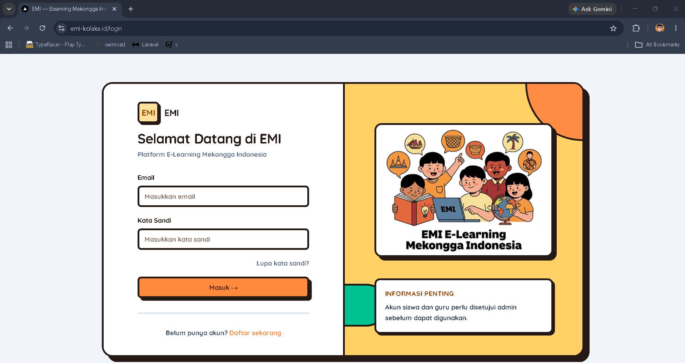
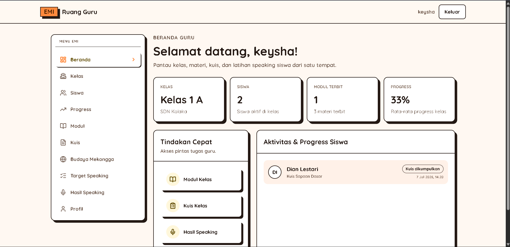
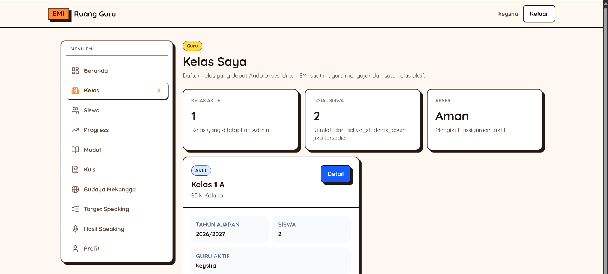
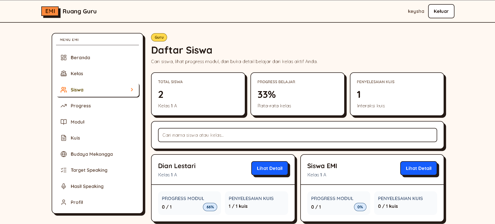
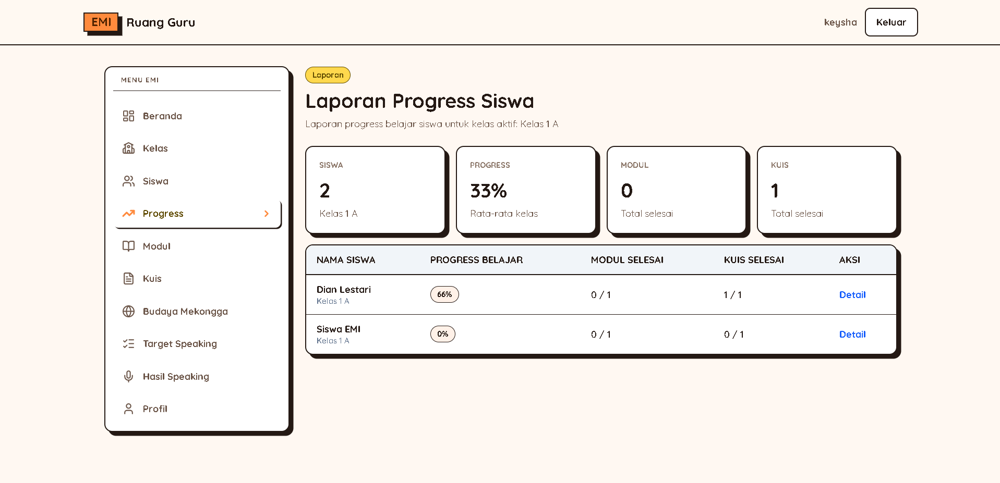
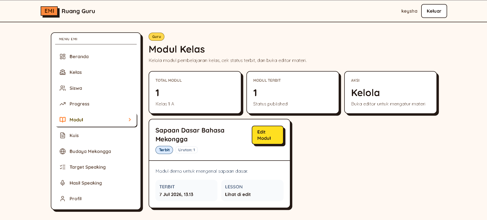
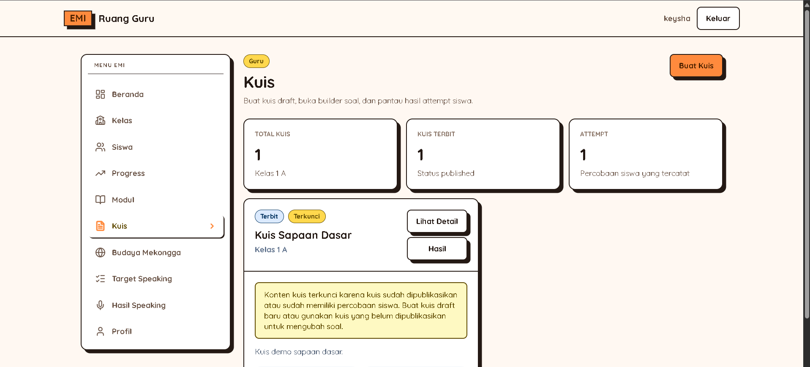
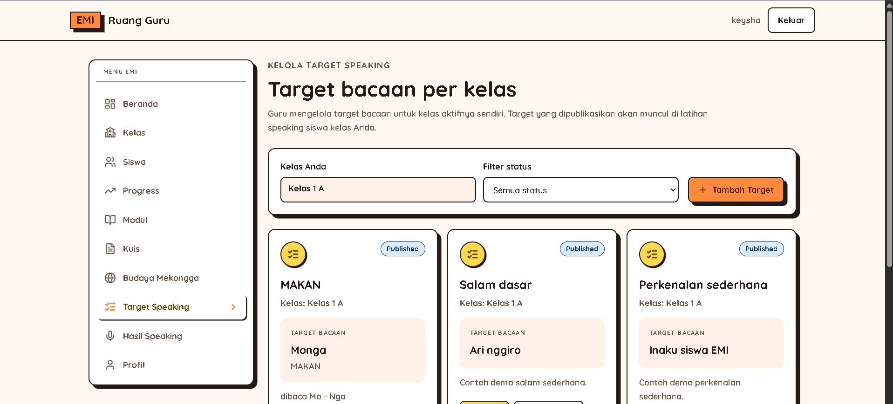
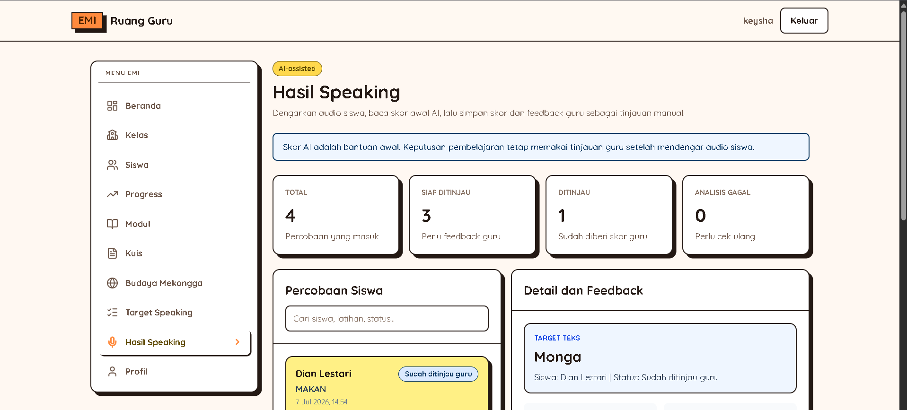
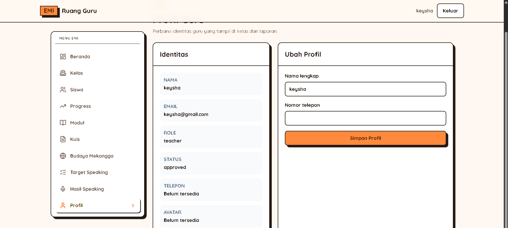

# Panduan Guru EMI

## 1. Tentang Role Guru

Guru adalah pengguna yang mengelola kegiatan belajar di kelasnya. Guru dapat melihat kelas yang diajar, mengelola siswa, mengelola modul atau materi kelas, mengelola kuis, melihat hasil kuis, membuat target speaking, meninjau hasil speaking, dan melihat progress siswa.

Guru hanya melihat data yang berhubungan dengan kelas yang diajar. Jika kelas belum muncul, biasanya akun guru belum ditugaskan ke kelas oleh admin.

## 2. Akun Demo Guru

Contoh email akun demo guru:

`guru.rina@emi.local`

`guru.arman@emi.local`

Password mengikuti password demo yang diberikan pengelola sistem.

Jangan membagikan password demo di dokumen umum, chat grup terbuka, atau media yang tidak aman.

## 3. Cara Login

1. Buka halaman login.
2. Masukkan email dan password guru.
3. Klik Masuk.
4. Sistem akan membuka dashboard guru.

## 4. Ringkasan Alur Kerja Guru

Login → Dashboard → Pilih Kelas → Kelola Siswa → Kelola Modul/Materi → Kelola Kuis → Review Speaking → Pantau Progress.

Alur sederhana penggunaan guru:

1. Login sebagai guru.
2. Cek ringkasan aktivitas di dashboard.
3. Pilih kelas yang diajar.
4. Lihat siswa dalam kelas.
5. Siapkan modul dan materi belajar.
6. Buat atau kelola kuis.
7. Buat target speaking dan review hasil speaking siswa.
8. Pantau progress siswa dari laporan.

## 5. Panduan Tiap Menu Guru

### Dashboard Guru

- URL: `/teacher/dashboard`
- Tujuan: Melihat ringkasan aktivitas mengajar.
- Yang dapat dilihat:
  - Ringkasan kelas yang diajar.
  - Jumlah siswa.
  - Ringkasan modul, kuis, dan progress jika tersedia.
- Yang dapat dilakukan:
  - Membuka menu guru lain dari navigasi.
  - Mengecek apakah data kelas dan siswa sudah muncul.
- Langkah penggunaan:
  1. Login sebagai guru.
  2. Buka dashboard guru.
  3. Periksa ringkasan kelas, siswa, modul, kuis, dan progress.
  4. Pilih menu lain jika ingin mengelola data.
- Hasil yang diharapkan: Guru melihat gambaran umum kegiatan kelas.
- Catatan penting: Jika kelas kosong, hubungi admin agar akun guru ditugaskan ke kelas.
- Placeholder screenshot:
  

### Kelas Guru

- URL: `/teacher/classes`
- Tujuan: Melihat daftar kelas yang diajar.
- Yang dapat dilihat:
  - Nama kelas.
  - Nama sekolah.
  - Jumlah siswa.
  - Status kelas.
- Yang dapat dilakukan:
  - Membuka detail kelas.
  - Membuka bagian siswa, modul, kuis, atau budaya dari kelas.
  - Mencari atau memfilter kelas jika tersedia.
- Langkah penggunaan:
  1. Buka menu Kelas Guru.
  2. Cari kelas yang ingin dikelola.
  3. Klik kelas untuk membuka detail.
  4. Pilih bagian siswa, modul, kuis, atau budaya sesuai kebutuhan.
- Hasil yang diharapkan: Guru dapat memilih kelas yang akan dikelola.
- Catatan penting: Guru hanya dapat melihat kelas yang ditugaskan oleh admin.
- Placeholder screenshot:
  

### Detail Kelas Guru

- URL: `/teacher/classes/[classId]`
- Tujuan: Melihat ringkasan satu kelas.
- Yang dapat dilihat:
  - Detail kelas.
  - Nama sekolah.
  - Statistik siswa, modul, dan kuis jika tersedia.
- Yang dapat dilakukan:
  - Membuka daftar siswa.
  - Membuka modul kelas.
  - Membuka kuis kelas.
  - Membuka budaya kelas.
- Langkah penggunaan:
  1. Buka menu Kelas Guru.
  2. Pilih salah satu kelas.
  3. Periksa ringkasan kelas.
  4. Klik menu siswa, modul, kuis, atau budaya untuk mengelola kelas.
- Hasil yang diharapkan: Guru memahami kondisi umum kelas sebelum mengelola materi.
- Catatan penting: Jika detail kelas tidak bisa dibuka, pastikan guru memang ditugaskan ke kelas tersebut.
- Placeholder screenshot:
  [Screenshot: Detail Kelas Guru]

### Siswa Kelas

- URL: `/teacher/classes/[classId]/students`
- Tujuan: Melihat daftar siswa dalam satu kelas.
- Yang dapat dilihat:
  - Nama siswa.
  - Status siswa.
  - Progress ringkas jika tersedia.
- Yang dapat dilakukan:
  - Mencari atau memfilter siswa jika tersedia.
  - Membuka detail siswa.
- Langkah penggunaan:
  1. Buka menu Kelas Guru.
  2. Pilih kelas.
  3. Buka bagian Siswa.
  4. Cari siswa yang ingin dilihat.
  5. Klik siswa untuk membuka detail jika tersedia.
- Hasil yang diharapkan: Guru mengetahui daftar siswa di kelasnya.
- Catatan penting: Jika siswa belum muncul, minta admin memeriksa penempatan siswa ke kelas.
- Placeholder screenshot:
  [Screenshot: Siswa Kelas]

### Modul Kelas

- URL: `/teacher/classes/[classId]/modules`
- Tujuan: Mengelola modul belajar untuk kelas tertentu.
- Yang dapat dilihat:
  - Daftar modul kelas.
  - Status modul.
  - Urutan modul.
  - Daftar materi atau lesson jika tersedia.
- Yang dapat dilakukan:
  - Menambah modul kelas.
  - Menggunakan template modul jika tersedia.
  - Mengedit modul.
  - Menerbitkan modul.
  - Mengarsipkan atau menghapus modul jika tersedia.
  - Mengatur urutan modul jika tersedia.
- Langkah penggunaan:
  1. Buka detail kelas.
  2. Pilih bagian Modul.
  3. Klik Tambah atau pilih template jika tersedia.
  4. Isi judul, deskripsi, status, dan urutan.
  5. Simpan dan terbitkan jika modul sudah siap.
- Hasil yang diharapkan: Siswa di kelas dapat melihat modul yang sudah diterbitkan.
- Catatan penting: Modul draft biasanya belum terlihat oleh siswa.
- Placeholder screenshot:
  [Screenshot: Modul Kelas]

### Kuis Kelas

- URL: `/teacher/classes/[classId]/quizzes`
- Tujuan: Mengelola kuis untuk kelas tertentu.
- Yang dapat dilihat:
  - Daftar kuis kelas.
  - Status kuis.
  - Jadwal jika tersedia.
  - Pengaturan percobaan kuis.
- Yang dapat dilakukan:
  - Menambah kuis.
  - Menggunakan template kuis jika tersedia.
  - Membuka builder kuis.
  - Melihat hasil kuis.
  - Menerbitkan atau mengarsipkan kuis jika tersedia.
- Langkah penggunaan:
  1. Buka detail kelas.
  2. Pilih bagian Kuis.
  3. Klik Tambah Kuis atau pilih template.
  4. Isi judul, jadwal, nilai kelulusan, dan batas percobaan.
  5. Buka builder untuk menambah soal.
  6. Terbitkan jika kuis sudah siap.
- Hasil yang diharapkan: Siswa dapat mengerjakan kuis yang sudah diterbitkan.
- Catatan penting: Kuis yang sudah dikerjakan siswa mungkin tidak bisa diubah bebas.
- Placeholder screenshot:
  [Screenshot: Kuis Kelas]

### Budaya Kelas

- URL: `/teacher/classes/[classId]/culture`
- Tujuan: Mengelola konten budaya untuk kelas tertentu.
- Yang dapat dilihat:
  - Daftar konten budaya kelas.
  - Status konten.
  - File atau URL jika tersedia.
- Yang dapat dilakukan:
  - Menambah konten budaya jika tersedia.
  - Mengedit konten.
  - Menerbitkan konten.
  - Mengarsipkan konten.
  - Menghapus konten jika tersedia.
- Langkah penggunaan:
  1. Buka detail kelas.
  2. Pilih bagian Budaya.
  3. Tambah atau pilih konten yang ingin diedit.
  4. Isi judul, deskripsi, tipe konten, dan media jika ada.
  5. Simpan dan terbitkan jika sudah siap.
- Hasil yang diharapkan: Siswa dapat melihat konten budaya kelas yang diterbitkan.
- Catatan penting: Halaman ini mungkin diarahkan ke menu Budaya Guru. Perlu dicek saat review final.
- Placeholder screenshot:
  [Screenshot: Budaya Kelas]

### Siswa Guru

- URL: `/teacher/students`
- Tujuan: Melihat semua siswa yang diajar guru.
- Yang dapat dilihat:
  - Daftar siswa.
  - Kelas siswa.
  - Sekolah.
  - Progress ringkas.
- Yang dapat dilakukan:
  - Mencari siswa.
  - Memfilter siswa jika tersedia.
  - Membuka detail siswa.
- Langkah penggunaan:
  1. Buka menu Siswa Guru.
  2. Cari nama atau email siswa.
  3. Periksa kelas dan progress ringkas.
  4. Klik siswa untuk membuka detail.
- Hasil yang diharapkan: Guru dapat menemukan siswa lintas kelas yang diajar.
- Catatan penting: Guru hanya melihat siswa dari kelasnya sendiri.
- Placeholder screenshot:
  

### Detail Siswa Guru

- URL: `/teacher/students/[studentId]`
- Tujuan: Melihat detail dan progress satu siswa.
- Yang dapat dilihat:
  - Profil siswa.
  - Kelas siswa.
  - Progress modul.
  - Progress kuis.
- Yang dapat dilakukan:
  - Membuka laporan atau detail progress jika tersedia.
  - Kembali ke daftar siswa.
- Langkah penggunaan:
  1. Buka menu Siswa Guru.
  2. Pilih siswa.
  3. Periksa profil dan progress siswa.
  4. Gunakan laporan jika tersedia untuk melihat detail lebih lengkap.
- Hasil yang diharapkan: Guru memahami perkembangan belajar siswa tertentu.
- Catatan penting: Jika siswa bukan bagian dari kelas guru, data tidak seharusnya bisa dibuka.
- Placeholder screenshot:
  [Screenshot: Detail Siswa Guru]

### Laporan Progress Guru

- URL: `/teacher/reports/progress`
- Tujuan: Melihat laporan progress kelas dan siswa.
- Yang dapat dilihat:
  - Progress kelas.
  - Progress siswa.
  - Filter periode jika tersedia.
- Yang dapat dilakukan:
  - Memfilter berdasarkan kelas, siswa, atau periode.
  - Export laporan jika tersedia.
  - Membuka detail siswa jika tersedia.
- Langkah penggunaan:
  1. Buka menu Laporan Progress Guru.
  2. Pilih kelas, siswa, atau periode jika tersedia.
  3. Periksa tabel progress.
  4. Export laporan jika diperlukan.
- Hasil yang diharapkan: Guru dapat memantau hasil belajar siswa.
- Catatan penting: Data progress hanya muncul jika siswa sudah mulai belajar atau mengerjakan kuis.
- Placeholder screenshot:
  

### Modul Guru

- URL: `/teacher/modules`
- Tujuan: Mengelola semua modul kelas milik guru.
- Yang dapat dilihat:
  - Daftar modul dari kelas yang diajar.
  - Status modul.
  - Kelas terkait.
- Yang dapat dilakukan:
  - Memfilter modul berdasarkan kelas jika tersedia.
  - Mengedit modul.
  - Menerbitkan atau mengarsipkan modul jika tersedia.
  - Membuka halaman edit materi.
- Langkah penggunaan:
  1. Buka menu Modul Guru.
  2. Pilih modul yang ingin dikelola.
  3. Periksa kelas dan status modul.
  4. Klik Edit untuk mengubah modul atau materi.
  5. Terbitkan jika modul sudah siap untuk siswa.
- Hasil yang diharapkan: Guru dapat mengelola modul lintas kelas dari satu tempat.
- Catatan penting: Menu Media Guru mungkin diarahkan ke halaman modul ini.
- Placeholder screenshot:
  

### Edit Modul Guru

- URL: `/teacher/modules/[classModuleId]/edit`
- Tujuan: Mengubah modul kelas dan daftar materinya.
- Yang dapat dilihat:
  - Detail modul.
  - Daftar lesson atau materi.
  - Status modul.
- Yang dapat dilakukan:
  - Mengubah judul dan deskripsi modul.
  - Mengubah status atau urutan.
  - Menambah atau mengedit lesson.
  - Menerbitkan modul.
- Langkah penggunaan:
  1. Buka menu Modul Guru.
  2. Pilih modul.
  3. Ubah judul, deskripsi, status, atau urutan jika perlu.
  4. Tambah atau edit materi.
  5. Simpan perubahan.
  6. Terbitkan jika modul sudah final.
- Hasil yang diharapkan: Modul kelas tersusun rapi dan siap dipelajari siswa.
- Catatan penting: Tombol terbitkan biasanya hanya muncul jika modul belum diterbitkan.
- Placeholder screenshot:
  [Screenshot: Edit Modul Guru]

### Edit Lesson Guru

- URL: `/teacher/modules/[classModuleId]/lessons/[classLessonId]/edit`
- Tujuan: Mengubah satu materi di dalam modul kelas.
- Yang dapat dilihat:
  - Judul materi.
  - Isi materi.
  - Media materi jika tersedia.
  - Status materi.
- Yang dapat dilakukan:
  - Mengubah judul materi.
  - Mengubah isi materi.
  - Mengunggah media.
  - Melepas media jika tersedia.
  - Menerbitkan materi.
- Langkah penggunaan:
  1. Buka halaman Edit Modul Guru.
  2. Pilih lesson atau materi yang ingin diedit.
  3. Ubah judul dan isi materi.
  4. Unggah media jika diperlukan.
  5. Simpan dan terbitkan jika sudah siap.
- Hasil yang diharapkan: Materi dapat dibaca siswa dengan isi yang benar.
- Catatan penting: Gunakan file media yang ringan dan sesuai kebutuhan belajar.
- Placeholder screenshot:
  [Screenshot: Edit Lesson Guru]

### Kuis Guru

- URL: `/teacher/quizzes`
- Tujuan: Mengelola semua kuis kelas milik guru.
- Yang dapat dilihat:
  - Daftar kuis kelas.
  - Status kuis.
  - Jadwal kuis.
  - Jumlah percobaan atau attempts jika tersedia.
- Yang dapat dilakukan:
  - Membuat kuis.
  - Membuka builder kuis.
  - Melihat hasil kuis.
- Langkah penggunaan:
  1. Buka menu Kuis Guru.
  2. Klik Buat Kuis.
  3. Pilih kelas jika diminta.
  4. Isi judul, jadwal, dan pengaturan kuis.
  5. Simpan lalu buka builder untuk menambah soal.
- Hasil yang diharapkan: Guru dapat membuat dan mengelola kuis kelas.
- Catatan penting: Jika tidak ada kelas, tombol buat kuis mungkin tidak aktif.
- Placeholder screenshot:
  

### Builder Kuis Guru

- URL: `/teacher/quizzes/[classQuizId]/builder`
- Tujuan: Mengedit kuis dan soal untuk kelas.
- Yang dapat dilihat:
  - Detail kuis.
  - Daftar pertanyaan.
  - Pilihan jawaban.
  - Gambar soal jika tersedia.
- Yang dapat dilakukan:
  - Menyimpan pengaturan kuis.
  - Menambah soal.
  - Mengedit atau menghapus soal jika tersedia.
  - Menambah pilihan jawaban.
  - Mengunggah gambar soal.
  - Menerbitkan kuis.
- Langkah penggunaan:
  1. Buka menu Kuis Guru.
  2. Pilih kuis dan buka builder.
  3. Tambahkan pertanyaan.
  4. Isi pilihan jawaban dan jawaban benar.
  5. Simpan soal.
  6. Terbitkan kuis jika semua soal sudah siap.
- Hasil yang diharapkan: Kuis memiliki soal yang dapat dikerjakan siswa.
- Catatan penting: Jika kuis sudah dikerjakan siswa, soal mungkin terkunci dan tidak bisa diubah.
- Placeholder screenshot:
  [Screenshot: Builder Kuis Guru]

### Hasil Kuis Guru

- URL: `/teacher/quizzes/[classQuizId]/results`
- Tujuan: Melihat hasil kuis siswa.
- Yang dapat dilihat:
  - Daftar attempt atau pengerjaan kuis.
  - Nama siswa.
  - Skor.
  - Status.
  - Detail jawaban jika tersedia.
- Yang dapat dilakukan:
  - Mencari siswa berdasarkan nama atau email.
  - Membuka detail hasil.
  - Menutup detail hasil.
- Langkah penggunaan:
  1. Buka menu Kuis Guru.
  2. Pilih kuis.
  3. Buka Hasil Kuis.
  4. Cari siswa jika diperlukan.
  5. Buka detail untuk melihat jawaban.
- Hasil yang diharapkan: Guru mengetahui hasil kuis siswa.
- Catatan penting: Tidak terlihat fitur mengubah nilai dari halaman ini.
- Placeholder screenshot:
  [Screenshot: Hasil Kuis Guru]

### Budaya Guru

- URL: `/teacher/culture`
- Tujuan: Mengelola konten budaya untuk kelas guru.
- Yang dapat dilihat:
  - Daftar konten budaya.
  - Status konten.
  - Media atau link jika tersedia.
  - Kelas terkait jika tersedia.
- Yang dapat dilakukan:
  - Menambah konten budaya.
  - Mengedit konten.
  - Menerbitkan konten.
  - Mengarsipkan konten.
  - Menghapus konten dari kelas.
- Langkah penggunaan:
  1. Buka menu Budaya Guru.
  2. Pilih kelas jika tersedia.
  3. Tambah atau pilih konten budaya.
  4. Isi judul, deskripsi, tipe konten, dan media jika ada.
  5. Simpan dan terbitkan jika sudah siap.
- Hasil yang diharapkan: Konten budaya kelas siap dilihat siswa.
- Catatan penting: Jika guru mengajar beberapa kelas, pilihan kelas perlu dicek dengan teliti.
- Placeholder screenshot:
  [Screenshot: Budaya Guru]

### Target Speaking Guru

- URL: `/teacher/speaking/exercises`
- Tujuan: Membuat dan mengelola target latihan speaking untuk siswa.
- Yang dapat dilihat:
  - Template speaking dari admin.
  - Target speaking kelas.
  - Status target.
  - Audio referensi jika tersedia.
- Yang dapat dilakukan:
  - Membuat target speaking.
  - Memilih template.
  - Mengedit target.
  - Mengarsipkan target.
  - Mengunggah audio referensi jika tersedia.
- Langkah penggunaan:
  1. Buka menu Target Speaking Guru.
  2. Klik Buat Target.
  3. Pilih kelas dan template jika tersedia.
  4. Isi judul, instruksi, dan teks latihan.
  5. Simpan dan terbitkan jika sudah siap.
- Hasil yang diharapkan: Siswa dapat melihat dan mengerjakan latihan speaking.
- Catatan penting: Draft dari admin sebaiknya tidak dipakai. Teks dan audio speaking perlu divalidasi narasumber.
- Placeholder screenshot:
  

### Hasil Speaking Guru

- URL: `/teacher/speaking/results`
- Tujuan: Meninjau hasil latihan speaking siswa.
- Yang dapat dilihat:
  - Daftar attempt speaking siswa.
  - Skor AI jika tersedia.
  - Audio siswa.
  - Transkrip atau feedback jika tersedia.
- Yang dapat dilakukan:
  - Memilih attempt siswa.
  - Mendengarkan audio jika tersedia.
  - Menulis feedback guru.
  - Menyimpan feedback.
- Langkah penggunaan:
  1. Buka menu Hasil Speaking Guru.
  2. Pilih attempt siswa.
  3. Dengarkan audio dan baca hasil transkrip jika tersedia.
  4. Tulis feedback yang jelas dan sopan.
  5. Klik Simpan Feedback.
- Hasil yang diharapkan: Siswa mendapatkan masukan dari guru atas latihan speaking.
- Catatan penting: Guru hanya dapat meninjau speaking siswa dari kelasnya sendiri.
- Placeholder screenshot:
  

### Media Guru

- URL: `/teacher/media`
- Tujuan: Mengunggah media pembelajaran jika halaman tersedia.
- Yang dapat dilihat:
  - Form upload media jika halaman aktif.
  - Atau halaman dapat diarahkan ke menu lain.
- Yang dapat dilakukan:
  - Mengunggah file media jika fitur tersedia.
  - Memilih kegunaan atau visibilitas media jika tersedia.
- Langkah penggunaan:
  1. Buka menu Media Guru.
  2. Jika form upload muncul, pilih file.
  3. Isi keterangan yang diminta.
  4. Klik Upload Media.
  5. Gunakan media pada modul, lesson, kuis, budaya, atau speaking jika tersedia.
- Hasil yang diharapkan: Media dapat dipakai untuk bahan ajar.
- Catatan penting: Halaman ini kemungkinan diarahkan ke menu Modul Guru. Perlu dicek saat review final.
- Placeholder screenshot:
  [Screenshot: Media Guru]

### Profil Guru

- URL: `/teacher/profile`
- Tujuan: Melihat dan memperbarui profil guru.
- Yang dapat dilihat:
  - Nama guru.
  - Email.
  - Role dan status.
  - Nomor telepon jika tersedia.
- Yang dapat dilakukan:
  - Mengubah nama.
  - Mengubah nomor telepon.
  - Menyimpan profil.
- Langkah penggunaan:
  1. Buka menu Profil Guru.
  2. Periksa data profil.
  3. Ubah nama atau nomor telepon jika perlu.
  4. Klik Simpan Profil.
- Hasil yang diharapkan: Profil guru tersimpan sesuai data terbaru.
- Catatan penting: Email dan status biasanya hanya bisa dilihat. Ubah password tidak terlihat di halaman profil guru.
- Placeholder screenshot:
  

## 6. FAQ Guru

### Mengapa kelas saya belum muncul?

Kelas muncul jika admin sudah menugaskan guru ke kelas tersebut. Hubungi admin dan minta akun guru diperiksa di data kelas.

### Bagaimana cara menambahkan materi?

Buka Modul Guru atau Modul Kelas, pilih modul, lalu buka halaman edit. Tambahkan lesson atau materi, isi judul dan konten, lalu simpan.

### Bagaimana cara membuat kuis?

Buka Kuis Guru atau Kuis Kelas, klik Buat Kuis, isi data kuis, lalu buka builder untuk menambahkan soal dan jawaban benar.

### Bagaimana cara melihat hasil kuis siswa?

Buka Kuis Guru, pilih kuis, lalu buka halaman Hasil Kuis. Gunakan pencarian jika ingin mencari siswa tertentu.

### Bagaimana cara membuat latihan speaking?

Buka Target Speaking Guru, klik Buat Target, pilih kelas dan template jika tersedia, isi instruksi latihan, lalu simpan atau terbitkan.

### Bagaimana cara memberi feedback speaking?

Buka Hasil Speaking Guru, pilih attempt siswa, dengarkan audio jika tersedia, tulis feedback, lalu klik Simpan Feedback.

### Mengapa modul atau kuis belum terlihat siswa?

Pastikan modul atau kuis sudah diterbitkan dan berada di kelas yang benar. Jika masih draft, siswa biasanya belum dapat melihatnya.

### Apakah guru bisa mengubah data siswa?

Guru dapat melihat siswa dan progress siswa. Perubahan data akun atau penempatan kelas biasanya dilakukan oleh admin.

## 7. Troubleshooting Guru

### Tidak bisa login

1. Pastikan email guru benar.
2. Pastikan password sesuai password demo yang diberikan pengelola sistem.
3. Pastikan akun guru sudah disetujui admin.
4. Jika tetap gagal, hubungi admin atau pengelola sistem.

### Kelas tidak muncul

1. Refresh halaman.
2. Periksa apakah login memakai akun guru yang benar.
3. Hubungi admin untuk memastikan guru sudah ditugaskan ke kelas.
4. Jika guru memang belum punya kelas, tunggu admin menambahkan assignment.

### Siswa tidak muncul

1. Pastikan kelas yang dipilih benar.
2. Periksa filter atau pencarian yang sedang aktif.
3. Hubungi admin untuk memastikan siswa sudah masuk kelas.
4. Jika kelas baru dibuat, tunggu data siswa ditambahkan oleh admin.

### Modul tidak terlihat siswa

1. Pastikan modul sudah diterbitkan.
2. Pastikan modul berada di kelas siswa.
3. Pastikan lesson atau materi juga sudah siap.
4. Jika memakai template, pastikan template sudah diterapkan ke kelas.

### Kuis tidak bisa dikerjakan siswa

1. Pastikan kuis sudah diterbitkan.
2. Pastikan jadwal kuis masih berlaku jika ada jadwal.
3. Pastikan siswa berada di kelas yang benar.
4. Pastikan siswa belum melewati batas percobaan.
5. Pastikan kuis memiliki soal dan jawaban benar.

### Audio speaking tidak muncul

1. Pastikan audio referensi sudah diunggah jika memang diperlukan.
2. Pastikan file audio tidak terlalu besar.
3. Coba refresh halaman.
4. Jika audio siswa tidak bisa diputar, hubungi pengelola sistem untuk memeriksa file.

### Progress siswa kosong

1. Pastikan siswa sudah masuk kelas.
2. Pastikan siswa sudah membuka modul atau mengerjakan kuis.
3. Periksa filter periode di laporan.
4. Jika siswa baru mulai belajar, progress mungkin masih kosong.

### Konten budaya tidak muncul

1. Pastikan konten budaya sudah diterbitkan.
2. Pastikan konten berada di kelas yang benar.
3. Periksa apakah konten masih draft atau archived.
4. Jika memakai media, pastikan file atau link bisa dibuka.

## 8. Catatan untuk Guru

Data bahasa dan budaya sebaiknya mengikuti arahan admin dan narasumber. Ini termasuk kosakata Mekongga, arti kata, contoh kalimat, teks speaking, konten budaya, foto, audio, dan video.

Gunakan materi demo hanya sebagai contoh alur belajar. Jangan menjadikan contoh bahasa atau budaya sebagai materi final sebelum disetujui narasumber.

Jika guru ingin menambahkan materi baru, pastikan isi materi sesuai arahan sekolah, admin, dan narasumber. Untuk media seperti foto, audio, atau video, pastikan ada izin penggunaan.

Bagian yang perlu review manual sebelum panduan final:

- Detail kartu dan tombol di Dashboard Guru.
- Filter dan pencarian di Kelas Guru.
- Pagination daftar siswa kelas.
- Alur halaman Budaya Kelas yang mungkin diarahkan ke Budaya Guru.
- Endpoint dan tampilan detail progress siswa guru.
- Export laporan progress guru.
- Tombol archive atau delete di Edit Modul Guru.
- Lock kuis setelah siswa mulai mengerjakan.
- Detail hasil kuis dan pencarian siswa.
- Pilihan kelas saat guru mengajar banyak kelas.
- Alur Media Guru yang mungkin diarahkan ke Modul Guru.
- Akses dan pemutaran audio speaking.
